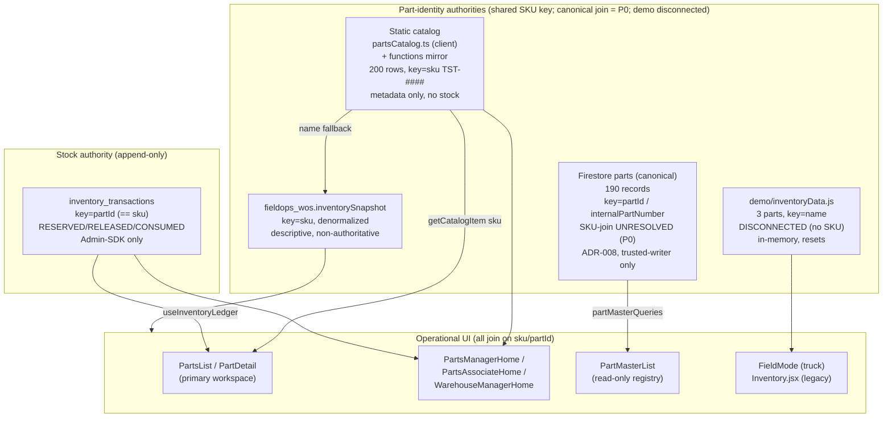

# Assessment: Inventory → Parts convergence recovery

**Recovery trigger.** This unit was opened on the working belief that the Part Master surface had been introduced as a *separate, competing user-facing product* alongside the existing Inventory → Parts workspace, and that the two now compete as general-user surfaces. The repository does not support that framing, and the correction matters to the plan: **Part Master, as it exists on baseline `bd65335`, is a single read-only admin/dispatcher registry nav item *inside* the Inventory domain — it has no create/edit/delete affordances and is not a general-user workspace** (`field-ops-app-vite/src/modules/inventory/PartMasterList.jsx:1-8`; deployment posture `docs/deployment/inv1-i1-readonly-part-master-visibility-plan.md`). The genuine defect this unit must resolve is narrower and real: **the operational Parts workspace (`PartsList`/`PartDetail`) still reads part identity from a static 200-row in-code catalog, while the newly created canonical Firestore `parts` collection (190 records) is read by only one island surface (`PartMasterList`).** This is a case of **multiple part-identity authorities and schemas with an unresolved canonical compatibility join** — not wholly disconnected systems. The operational layers already interoperate today through one SKU-shaped string: the static catalog's `sku`, the ledger's `partId` (`== sku`), reorder records' `partId`, and the Work Order `inventorySnapshot`'s `sku` are the same compatibility key (§1). The unresolved question is narrower — whether canonical `parts.partId` and/or `internalPartNumber` preserves that same SKU compatibility key or requires an alias/adapter mapping. (Only the demo layer's name-based ids are genuinely disconnected.) Convergence means switching the operational workspace's *identity source* onto the canonical collection, resolving that compatibility join, without disturbing the append-only ledger, the reorder workflow, or any historical record — not dismantling a rival product.

**This assessment authorizes NO implementation.** No production code, no Firestore data changes, no Rules, no Functions, no index, no UI, no deployment, no migration. It is grounded entirely in the repository at baseline `bd65335`.

---

## 1. Executive summary

- The inventory domain carries **four part-identity authorities/schemas**. Three of them (static catalog, ledger, reorder, Work Order snapshot) already interoperate through one SKU-shaped compatibility string; the canonical collection's join to that key is the unresolved question, and only the demo layer is genuinely disconnected:
  1. **Static catalog** — `field-ops-app-vite/src/data/partsCatalog.ts` (`PARTS_CATALOG`, **200** synthetic rows, SKUs `TST-1001…TST-1200`), byte-mirrored at `functions/src/data/partsCatalog.ts`. Metadata only, **no stock authority**, never seeded into Firestore (`partsCatalog.ts:1-19`). Key: `sku`.
  2. **Canonical Firestore `parts`** — the INV-1 Part Master collection, **190** records created 2026-07-24 through the trusted `createPart` command from an Owner-approved CSV (`docs/audits/inv1-phase1/create-execution-20260724/`). Keyed on immutable `partId` + governed `internalPartNumber` (ADR-008) — **whether either preserves the SKU compatibility key is unresolved (P0)**.
  3. **Demo in-memory** — `src/demo/inventoryData.js` (**3** parts: `Compressor`, `Capacitor`, `Filter Drier`; the human *name is the id*). Sole implementation of truck inventory; resets on reload. **Genuinely disconnected** — name-based ids, no SKU key.
  4. **Denormalized Work Order `inventorySnapshot`** — descriptive, non-authoritative copies embedded on `fieldops_wos`, keyed on `sku` (`functions/src/types/workOrder.ts:96-100`).
- The **live operational compatibility key is the SKU-shaped string.** The append-only ledger keys on `partId`, but the value stored is the Work Order snapshot's `sku` (`functions/src/inventoryService.ts:134` writes `partId: item.sku`; `functions/src/types/inventoryTransaction.ts:12` comments `partId: string; // sku`), and reorder records carry the same `partId`. Every *operational* surface joins on `sku`/`partId` string equality today. No `partNumber` field participates. The open issue is not that the layers are disjoint — it is whether the **canonical** collection preserves this key.
- **`PartsList` and `PartDetail` — the primary user workspace — read the static 200-row catalog, not Firestore `parts`.** `PartMasterList` is the *only* UI reading canonical `parts`. The two schemas **overlap materially on descriptive fields** — `name`, `category`, and unit semantics (`unit` ↔ `stockingUnit`) — while diverging on **identifier compatibility**, the commercial fields (`cost`, `price`, `reorderThreshold`, `warehouseQty`/static availability baseline), and the canonical governance fields (`status`, `controlType`, `stockingClass`). Convergence therefore requires a **layered adapter** combining canonical identity/governance, commercial authority, and ledger-derived operational values — not a wholesale replacement of unrelated models. Canonical `parts` is currently a UI island only in the sense that nothing operational reads it yet.
- **The pivotal unknown for convergence:** whether the 190 canonical `partId`/`internalPartNumber` values **join to the static `TST-####` skus** cannot be confirmed from the repository — the migration input population manifest was not transferred into the evidence tree (`docs/audits/inv1-phase1/production-dryrun-20260723-01/evidence-review.md:37`). Establishing this join (or the alias map that bridges it) is parity gate **P0** and blocks any source switch.
- **200 vs 190 is policy-explained by Decision #42, but record-level reconciliation remains incomplete.** The 10-record gap is an **intentional pre-input exclusion of discontinued/inactive test parts** under Decision #42 D-M3 — *not* validation failure, dedup, or import rejection (all of which reported zero in the dry run: `evidence-review.md:24`). That is the *policy* explanation; it is **not yet a proven record-level reconciliation**, because the exact ten-record manifest is absent (open item **UD-1**) and the canonical `partId`/`internalPartNumber`→SKU join is unresolved (**P0**). UD-1 and P0 block operational source switch, static-catalog retirement, Functions-mirror retirement, and any declaration of catalog/canonical parity — but not merging this corrected docs-only assessment.
- **Production `parts` write authority is already correct and locked.** `firestore.rules:1554-1557`: `read: if isAdminOrDispatcher(); create, update, delete: if false`. All part-master and physical collections are trusted-writer/Admin-SDK-only. No client CRUD exists or is proposed.
- **Recommended disposition of Part Master navigation:** retain it as **admin/dispatcher-only verification/admin scaffolding** through convergence, then **retire the general-visibility nav entry** once the operational Parts workspace surfaces canonical identity. Retirement is a one-line deletion (`navConfig.js:175`). It must not remain, and was never built as, a competing general-user workspace.

---

## 2. Current-state architecture

**Reading the diagram.** The primary workspace (`PartsList`/`PartDetail`) and the three role homes draw identity from the **static catalog** and stock from the **ledger** — which already share the SKU compatibility key — but do not yet read canonical `parts`. `PartMasterList` is the only consumer of canonical `parts`; whether its `partId`/`internalPartNumber` resolves to that same SKU key is the unresolved P0 join, not a proven mismatch. The demo substrate (genuinely disconnected, name-keyed) feeds only `FieldMode` and the unrouted legacy `Inventory.jsx`. The convergence work is to redirect the left-side operational reads from `STATIC` onto `CANON` through a layered adapter that resolves the compatibility join, while preserving the ledger and every historical record untouched.

### 2.1 The three prior governance layers (context, not re-litigated)

The Enterprise Inventory assessment (`docs/assessments/enterprise-inventory-architecture.md`, DECISIONS #37) established the domain as three coexisting layers (ledger+physical / reorder workflow / legacy demo) with the catalog as static in-code data. ADR-008 (DECISIONS #40) then adopted canonical `parts`/`partId` as identity authority with a normalized model (`parts`, `part_aliases`, `part_supplier_items`, `part_relationships`, `manufacturers`). Decision #42 (D-M1…D-M7) set the additive, dual-read, Owner-gated migration policy. **This assessment refines, and does not contradict, that chain.** The convergence it describes is the "dual-read → cutover" step ADR-008 §36-38 already anticipated, scoped specifically to the existing Parts workspace.

---

## 3. Complete dependency matrix

### 3.1 Identity / catalog sources

| Source | File | Records | Key | Fields | R/W | Historical | Disposition |
|---|---|---|---|---|---|---|---|
| Static client catalog | `field-ops-app-vite/src/data/partsCatalog.ts:31` | 200 (`TST-1001…1200`) | `sku` | `sku,name,category,unit,cost,price,reorderThreshold,warehouseQty` | R (UI enrichment) | No | **Retire last** — bootstrap/seed only (ADR-008 §31); freeze, then remove after cutover |
| Static server mirror | `functions/src/data/partsCatalog.ts` | 200 (identical) | `sku` | same 8 fields | R (availability baseline) | No | **Retire with client** — `warehouseQty` baseline must be replaced by a ledger aggregate first |
| Canonical Firestore `parts` | `parts` collection; read via `services/partMasterQueries.js:10,17` | 190 | `partId` / `internalPartNumber` | `internalPartNumber,name,category,controlType,stockingClass,stockingUnit,status` | R (client, admin/dispatcher); W trusted-writer only | Canonical registry | **Promote to identity authority** for the Parts workspace |
| Demo identities | `field-ops-app-vite/src/demo/inventoryData.js:13-17` | 3 | `name` (== id) | `id,name,unit` | R/W in-memory | No | **Carve out** — never joins on `partId`; migrate under truck-inventory work (#182), not this unit |
| WO `inventorySnapshot` | `functions/src/types/workOrder.ts:96-100` | per-WO | `sku` | `sku,name,qtyPlanned[,qtyUsed]` | R by all consumers; written by WO engine | **Immutable descriptive copy** | **Never rewrite**; enrich read-side via `partMaster/workOrderSnapshotCompatibility.ts` |

### 3.2 Ledger and physical-state collections

| Collection / Service | File | Key | R/W | Historical (immutable)? | Rules / Functions dep |
|---|---|---|---|---|---|
| `inventory_transactions` (stock authority) | `functions/src/inventoryService.ts:91-97,134,150` | `partId` (== sku), `workOrderId` | `tx.set()` new doc only | **YES — append-only ledger** | `firestore.rules:488-493` read admin/dispatcher + ACTIVE PARTS_MANAGER/WAREHOUSE_MANAGER; **create/update/delete `if false`** |
| `inventory_sync_status` | `functions/src/inventoryService.ts:192-246` | `workOrderId` | Read+Write (mutable) | No — idempotency bookkeeping | `firestore.rules:495-498` fully closed to clients |
| `stock_locations` | `functions/src/warehouseService.ts:23-70` | `warehouseId__partId__binCode` | Read+Write (delta, not idempotent) | No — mutable physical state | `firestore.rules:1172-1175` writes `if false` |
| `transfer_orders` | `functions/src/warehouseService.ts:80-120` | auto; `partId`,`from/to` | Read+Write (state machine) | No | `firestore.rules:1183-1188` writes `if false` |
| `warehouses` | `functions/src/warehouseService.ts` | `warehouseId` | Read | Reference | `firestore.rules:1167-1170` writes `if false` |
| `suppliers` | `functions/src/supplierService.ts:13-16` | `id` | Read | Reference | `firestore.rules:1195-1198` writes `if false` |
| `supplier_catalog` | `functions/src/supplierService.ts:18-39` | `supplierId`,`partId`,`available` | Read | Reference | `firestore.rules:1200-1203` writes `if false` |
| `purchase_orders` (Epic 5, dormant) | `functions/src/procurementService.ts:25-84` | auto; `supplierId` | Read+Write (Admin SDK) | No | `firestore.rules:1205-1208` read admin/dispatcher, writes `if false` |

### 3.3 Reorder workflow and audit collections (client-writable, ledger-independent)

| Collection | File | Key | R/W | Historical (immutable)? | Rules dep |
|---|---|---|---|---|---|
| `reorder_requests` | `domain/inventoryReorderRequests.js`; hook `useReorderRequests.js` | `partId` (denormalized); auto id | Client-direct write + realtime/paginated read | **Mixed** — mutable state, immutable base facts pinned by Rules | `firestore.rules:508-517,586+` eight-branch governed lifecycle; **no Cloud Function** |
| `inventory_actions` | `domain/inventoryActions.js`; hook `useInventoryActions.js` | `partId` | Client create-only + realtime read | **YES — append-only audit** (never applied to stock) | `firestore.rules:1145-1149` create admin/dispatcher; update/delete `if false` |
| `reorder_purchase_orders` | `domain/reorderPurchaseOrders.js`; hook `useReorderPurchaseOrders.js` | doc id == `reorderRequestId`; `partId` denorm | Client txn create-only + realtime read | **YES — create-only** | `firestore.rules:1027-1071` create gated + `getAfter` invariant; update/delete `if false` |
| `reorder_purchase_order_voids` | `domain/reorderPurchaseOrders.js`; hook `useReorderPurchaseOrderVoids.js` | doc id == `reorderRequestId`; `partId` denorm | Client txn create-only + realtime read | **YES — sole append-only void record** | `firestore.rules:1089-1121` create gated + two-sided invariant; update/delete `if false` |

### 3.4 UI / service consumers (source-switch exposure)

| Consumer | File | Source today | Key | Fields | R/W | Historical | Migration risk | Required parity test |
|---|---|---|---|---|---|---|---|---|
| **PartsList** (primary workspace) | `modules/inventory/PartsList.jsx:442,469,732` | Static catalog + ledger + reorder hooks | `sku`/`partId` | catalog `sku,name,category,warehouseQty`; health overlay; requests | R + W (`requestReorderForRecommendation`) | Yes (RR history) | **HIGH** — treats `PARTS_CATALOG` as complete list; assumes `entry.partId===part.sku`; seeds Global Search | Canonical list parity vs catalog; `partId↔sku` join; search routing |
| **PartDetail** | `modules/inventory/PartDetail.jsx:1174,1189,1219` | Static `getCatalogItem` + ledger `t.partId===partId` + full reorder/PO lifecycle | route `partId` (== sku) | `name,sku,category,unit,cost,price,warehouseQty,reorderThreshold`; transactions; reorder | R + **heavy W** | Yes (transactions, RR/PO/void) | **HIGHEST** — metadata read and ledger filter must re-point together or page hard-fails "Unknown part" | Per-part metadata parity; ledger filter join; unknown-id fallback |
| **WarehouseManagerHome** | `modules/inventoryRole/WarehouseManagerHome.jsx:163,249,141` | Static catalog + ledger + actions | `sku`/`partId` | catalog + health + action log | R + **W** (reorder NEEDS_PLANNING) | Activity log | **HIGH** — static-as-master + write surface; broken join mis-keys reorder requests | Same join test as PartsList + write round-trip |
| **PartsManagerHome** | `modules/inventoryRole/PartsManagerHome.jsx:68,118` | Ledger + reorder + `getCatalogItem` | `partId`/`sku` | health; request fields | R + W (assign) | Yes (reviewed history) | MED — name via catalog only | Name-resolution parity |
| **PartsAssociateHome** | `modules/inventoryRole/PartsAssociateHome.jsx` | Reorder + PO hooks + `getCatalogItem` | `partId`/`sku` | request summary; PO fields | R + W (purchasing) | Yes (terminal cards) | MED — name via catalog only | Name-resolution parity |
| **InventoryHealthPanel** | `modules/operations/panels/InventoryHealthPanel.jsx:1,89` | Ledger props + `getCatalogItem` name | `partId` | health; name | R (+W if wired) | No | LOW — graceful `?? partId` fallback | Name-resolution parity |
| **WarehousePanel** | `modules/operations/panels/WarehousePanel.jsx:29,62,94` | Warehouse engine props + catalog name | `partId` | bin/reconciliation; name | R | No | LOW — name fallback only | Name-resolution parity |
| **PartsOverviewPanel** | `modules/controlTower/panels/PartsOverviewPanel.jsx:27,55` | WO `inventorySnapshot` + catalog name fallback | `sku` | `sku,name,qtyPlanned` | R | No | LOW — snapshot-keyed; name fallback | Snapshot name fallback under renumber |
| **ExecutionCapture** | `modules/technicianDashboard/ExecutionCapture.jsx:38,78` | WO snapshot + catalog name; writes WO doc | `sku` | `sku,name,qtyPlanned,qtyUsed` | R + W (WO doc via Fn) | executionLog | LOW (identity) — writes WO, not parts | Snapshot name fallback |
| **TechnicianWorkOrderCard** | `modules/technicianDashboard/TechnicianWorkOrderCard.jsx` | WO snapshot + catalog name | `sku` | `qtyPlanned`, name | R | No | LOW | Snapshot name fallback |
| **WorkOrderDetail** | `modules/controlTower/WorkOrderDetail.jsx:5,109` | WO snapshot + `getCatalogItem` | `sku` | `sku,name,category,unit,qtyPlanned,qtyUsed` | R | No | LOW — "visual only" | Snapshot name fallback |
| **NotificationPanel** | `shared/ui/NotificationPanel.jsx:3,51` | Reorder Firestore + catalog name; links `/inventory/:partId` | `partId` | request→name; links | R | Links to history | LOW — name + deep-link | Deep-link id continuity |
| **Global Search (parts provider)** | `shared/search/searchProviders.js:73-93` (wired from `PartsList.jsx:469`) | Static `PARTS_CATALOG`; routes `/inventory/:sku` | `sku` | `sku,name,category` | R | No | MED — indexes only static catalog; route id must match PartDetail key | Search→route→detail id continuity |
| **PartMasterList** | `modules/inventory/PartMasterList.jsx:10` | **Canonical `parts`** (`getDocs(collection(db,"parts"))`) | `partId` / `internalPartNumber` | `internalPartNumber,name,category,controlType,stockingClass,stockingUnit,status` | R (governed, no writes) | No | N/A — already canonical | Convergence target reference |
| **Inventory.jsx** (legacy, unrouted) | `modules/inventory/Inventory.jsx:42` | Demo `InventoryContext` | name | `id,name,unit`, warehouse/truck maps | R + W (in-memory) | No | Carve-out — never joins | n/a (retire) |
| **FieldMode** (truck) | `modules/mobile/FieldMode.jsx:12,50` | Demo `InventoryContext` | name | parts/truckStock by name | R + W (in-memory) | Session | Carve-out — #182 scope | n/a (out of scope) |

> **Scope notes.** No `PartsScanner.jsx` exists at baseline `bd65335` (the mobile folder holds only `FieldMode.jsx`); the untracked `PartsScanner.jsx` in a divergent working tree is a parallel session's uncommitted file and is out of scope. No UI *authors* `inventorySnapshot`; it is produced server-side by the Work Order engine, and the WO wizard contains no part-selection code.

---

## 4. 200-versus-190 reconciliation

**Result: 200→190 is policy-explained by Decision #42, but record-level reconciliation remains incomplete until the exact excluded-record manifest (UD-1) and the P0 identifier join are proven.** The count difference has an intended *policy* explanation (a governance exclusion of 10 discontinued/inactive parts); it is not yet a *proven* record-level reconciliation, and this section must not be read as one.

| Layer | Count | Source of truth |
|---|---|---|
| Static UI catalog (client + server mirror) | **200** | `partsCatalog.ts:31`, SKUs `TST-1001…TST-1200` (contiguous, unique) |
| Canonical Firestore `parts` (production) | **190** | `docs/audits/inv1-phase1/create-execution-20260724/closure-record.md:33,40,42` (SUCCESS=190, FAILED/CONFLICT/INVALID=0) |

**Mechanism (evidence chain):**
1. The static catalog files are **never seeded** into Firestore — they are UI/compute metadata only (`partsCatalog.ts:1-19`; `functions/src/inventoryService.ts:48-49`).
2. Canonical `parts` is populated exclusively by the governed CSV → `createPart` pipeline (`functions/scripts/executePartMasterCreate.js:138-141`), which hard-refuses unless every row classifies CREATE and the count equals `--expected-count` (pinned **190**; `executePartMasterCreate.js:129-131`).
3. The classifier's reject/dedup paths — `MISSING_REQUIRED_FIELD`, `MALFORMED_IDENTIFIER`, `UNKNOWN_UNIT`, `DUPLICATE_PART_ID_IN_FILE`, `DUPLICATE_IPN_IN_FILE`, `DOMAIN_VALIDATION_FAILED` (`functions/src/partMaster/csvMigrationAnalysis.ts:168-194,244,299`) — each fired **zero times** in the production dry run (`docs/audits/inv1-phase1/production-dryrun-20260723-01/evidence-review.md:24`). The gap is therefore **not** validation, dedup, or import rejection.
4. The gap exists **upstream of the CSV**: the input population was **190 active** parts; **10 discontinued/inactive test parts were excluded** under **Decision #42 D-M3** (inactive-target rows excluded until separately remediated through lifecycle governance) — `evidence-review.md:35`; readiness input `docs/audits/inv1-phase1/migration-readiness/cutover-readiness.json:140`.

**Which exact ten?** The concrete identity manifest of the 10 excluded parts **cannot be produced from this repository.** The catalog files carry no active/discontinued status column (their field set is `sku,name,category,unit,cost,price,reorderThreshold,warehouseQty`), so the exclusion rule cannot be replayed against `partsCatalog.ts` alone; and the `discontinued-parts-manifest.csv` (+ SHA-256) is a **recorded open item** that was not transferred into the evidence tree (`evidence-review.md:37`). The mechanism is demonstrated on a fixture (`docs/audits/inv1-phase1/migration-readiness/conflicts.csv:2` → `TARGET_PART_INACTIVE … DISCONTINUED`).

> **Blocking (UD-1 + P0):** until the exact ten-record manifest is obtained/regenerated **and** the canonical `partId`/`internalPartNumber`→SKU join is proven, record-level catalog/canonical reconciliation is not established. UD-1 and P0 therefore **block** the operational source switch (Phase C), static-catalog retirement and Functions-mirror retirement (Phase F), and any declaration of catalog/canonical parity. They do **not** block merging this corrected docs-only assessment.

---

## 5. Duplicated truth layers — legitimate vs competing

| Layer | Classification | Rationale |
|---|---|---|
| Static client catalog (`partsCatalog.ts`) | **Duplicate to retire** | Metadata-only, superseded by canonical `parts` for identity; bootstrap/seed role only (ADR-008 §31) |
| Functions static mirror (`functions/src/data/partsCatalog.ts`) | **Duplicate to retire (with dependency)** | Byte-identical mirror; but supplies the `warehouseQty` availability baseline — must be replaced by a ledger aggregate before removal |
| Canonical Firestore `parts` | **Intended single identity authority** | ADR-008; promote, do not duplicate |
| Demo inventory identities (`inventoryData.js`) | **Isolated demo — carve out** | Name-keyed, disjoint; belongs to truck-inventory work (#182), not this unit |
| WO `inventorySnapshot` | **Legitimate immutable historical snapshot — KEEP** | Descriptive point-in-time copy; explicitly non-authoritative (`types/workOrder.ts:96-100`); must never be rewritten |
| `inventory_transactions` `partId` (== sku) | **Legitimate immutable ledger key — KEEP** | Append-only stock authority; grandfathered identity per ADR-008 §20 |

**The one genuine competing-authority risk** is *not* in the identity layer — it is over "how much stock exists": ledger-derived availability (`inventoryService.ts:47-61`) vs physical `stock_locations` quantities (`warehouseService.ts:35-70`). These are reconciled **read-only** and never auto-corrected (`warehouseReconciliationService.ts:1-13`), and human receipts (`inventory_actions`, reorder receiving) are **never applied back to the ledger** (`inventoryReorderRequests.js:255-262`). This is pre-existing (INV-1 domain), out of scope for identity convergence, and noted only so the convergence plan does not accidentally entangle it.

---

## 6. Target authority model

Convergence must **not** collapse everything onto the canonical Part document. The correct target is a **layered read model** with strict field authority (consistent with ADR-008 §22 and specification §7):

| Field group | Authority | Home | On the Part doc? |
|---|---|---|---|
| **Canonical identity** — `partId`, `internalPartNumber`, aliases | Part Master | `parts` (+ `part_aliases`) | Yes |
| **Descriptive** — `name`, `category`, `stockingUnit`, `controlType`, `stockingClass`, `status` | Part Master | `parts` | Yes |
| **Commercial** — `unitPrice`, supplier terms, `purchaseUnit`/conversion | Procurement | `part_supplier_items` / `supplier_catalog` | **No** (many suppliers per part) |
| **Legacy commercial display** — `cost`, `price` (today from static catalog) | Interim: static catalog → target: supplier items | migrate under procurement gate | No |
| **Stock / availability** — reserved/released/consumed, on-hand | Ledger | `inventory_transactions` (derived) | **No** |
| **Reorder policy inputs** — `reorderThreshold`, `warehouseQty` baseline (today static fictions) | Interim: static → target: ledger aggregate + governed policy | to be defined | No (policy object) |
| **Workflow-derived** — reorder request/PO/void state | Reorder workflow | `reorder_*` collections | No |
| **Usage/analytics** — avg daily usage, forecast | Derived | analytics engines (pure) | No |

**Read-model shape for the Parts workspace (composition, not a fat document):**
`PartWorkspaceRow = parts{partId, internalPartNumber, name, category, stockingUnit, controlType, stockingClass, status}` **⊕** ledger-derived `{availableStock, avgDailyUsage, recommendation}` (via `useInventoryLedger`) **⊕** reorder state (via reorder hooks) **⊕** (later) `part_supplier_items{cost, price}`. During transition, missing commercial fields fall back to the static catalog so no column disappears.

---

## 7. Phased convergence plan (each phase = separately Owner-gated; none authorized here)

> Additive and reversible throughout; mirrors the ADR-008 dual-read→cutover discipline (§36-38) and Decision #42's per-gate readiness rule. No historical rewrite at any phase.

**Phase A — Compatibility read adapter (repository only).**
Introduce a pure read adapter that maps a canonical `parts` doc to the shape `PartsList`/`PartDetail` consume today (resolving `partId↔sku`, filling commercial fields from the static catalog as fallback). No UI switch, no Rules change. Deliverable: adapter module + unit tests proving field-by-field equivalence to `getCatalogItem` for the joinable set.

**Phase B — Shadow parity comparison (repository/observability only).**
Run the adapter *alongside* the static catalog behind a diagnostic-only path; log/collect divergences (missing parts, mismatched names/categories, unjoinable skus). Produce the parity evidence artifact required before any user-visible switch. **Gate on P0 join resolution (§9).**

**Phase C — Existing Parts UI source switch (frontend + Rules).**
Re-point `PartsList`/`PartDetail` (then `WarehouseManagerHome`) identity reads from the static catalog to the canonical adapter, keeping ledger and reorder wiring intact. **Requires a Rules change**: broaden `parts` read from admin/dispatcher to the ACTIVE inventory operational roles (PARTS_MANAGER / PARTS_ASSOCIATE / WAREHOUSE_MANAGER), matching the Issue #100 matrix — a Tier-2, own-gate deploy (authorize→deploy→verify). Global Search parts provider re-pointed in the same phase to keep search→route→detail id continuity.

**Phase D — Downstream consumer migration.**
Migrate name-fallback consumers (role homes, panels, notifications) and snapshot-keyed consumers (Control Tower, technician cards) onto canonical name resolution via the adapter/`workOrderSnapshotCompatibility.ts`, preserving `sku` on historical snapshots. Demo surfaces (`Inventory.jsx`, `FieldMode`) are explicitly **carved out** (deferred to #182).

**Phase E — Part Master navigation retirement.**
Once the operational workspace surfaces canonical identity, remove the general Part Master nav entry (`navConfig.js:175`; optional `App.jsx:149-151` cleanup). Retain the read-only registry as an **admin/dispatcher verification tool** if still useful, or delete the components. One-line change; no Rules/data impact.

**Phase F — Static catalog and Functions mirror retirement.**
Only after (i) the `warehouseQty` availability baseline is replaced by a trusted ledger aggregate and (ii) UD-1 (10-part manifest) is resolved: freeze, then remove `field-ops-app-vite/src/data/partsCatalog.ts` and `functions/src/data/partsCatalog.ts`. Commercial `cost`/`price` must have moved to `part_supplier_items` (procurement gate) first.

**Phase G — Rollback and production verification.**
Each phase carries its own rollback (§10) and a production verification matrix (§8). Cutover of the read source is reversible by feature flag / revert until the static catalog is removed in Phase F.

---

## 8. Parity-test matrix

| ID | Test | Passes when |
|---|---|---|
| **P0** | Identity join: every static `TST-####` sku referenced by ledger/reorder/snapshot resolves to exactly one canonical `partId`/alias | 100% of *referenced* skus resolve; unresolved set enumerated and dispositioned |
| P1 | Set parity: canonical 190 vs static 200 | Difference == the 10 D-M3 discontinued parts (UD-1 manifest); no other divergence |
| P2 | Field parity (descriptive): `name`, `category`, `unit`/`stockingUnit` match adapter vs catalog for joinable parts | Zero mismatches, or every mismatch dispositioned as governed correction |
| P3 | Commercial fallback: `cost`/`price` present in workspace during transition | No column blanks vs today for any displayed part |
| P4 | Ledger filter continuity (`PartDetail` `t.partId===partId`) | Same transaction set returned pre/post switch |
| P5 | Reorder write round-trip (`PartsList`/`WarehouseManagerHome` `requestReorderForRecommendation`) | Request created with correct `partId`; no mis-key |
| P6 | Search→route→detail id continuity (Global Search) | `/inventory/:id` resolves to the same PartDetail pre/post |
| P7 | Snapshot name fallback under renumber | Historical WO snapshot `sku` still renders a name (canonical resolve or graceful raw-id) |
| P8 | Rules: operational roles can read `parts`; writes still denied for all clients | Phase-C Rules verification matrix green; `create/update/delete` denied incl. admin |
| P9 | Role-visibility parity: no surface exposes a part a role could not see before | Access matrix unchanged except the intended `parts` read broadening |

---

## 9. Unresolved decisions

- **UD-1 — The 10-part discontinued manifest.** Obtain or regenerate `discontinued-parts-manifest.csv` (+ SHA-256) so the 200↔190 delta is enumerable and auditable. Blocks Phase F. (`evidence-review.md:37`)
- **UD-2 — `partId` ↔ `sku` join model (P0).** Confirm whether the 190 canonical `partId`/`internalPartNumber` values equal the `TST-####` skus, or whether an alias map (`part_aliases`, currently 0 rows) must bridge them. This is the single largest technical risk to a clean source switch; it cannot be answered from the repository today.
- **UD-3 — `warehouseQty` baseline replacement.** Availability today = `warehouseQty − (reserved − released)` against the static baseline (`inventoryAnalyticsEngine.ts:243-258`). Removing the static mirror (Phase F) requires a trusted ledger-aggregate on-hand source first. Design owner: INV-1 enterprise plan.
- **UD-4 — Commercial field home.** `cost`/`price` live on the static catalog today; ADR-008 places commercial terms on `part_supplier_items` (0 rows). The procurement gate that populates supplier items is a separate Owner decision and gates Phase F.
- **UD-5 — Part Master nav disposition.** Retire entirely vs retain as admin/dispatcher verification tool. Recommendation: retain admin-only through convergence, retire general visibility in Phase E; final call is Owner's.

---

## 10. Rollback plan

- **Phases A–B** (repository/observability only): revert the PR; no runtime or data effect.
- **Phase C** (UI switch + Rules): source switch behind a revertable flag/commit; **Rules rollback** follows the F-RULES-1 D2 precedent — capture the pre-deploy production ruleset (SHA-256) as the rollback artifact, byte-verify the deployed ruleset, and re-deploy the captured baseline on any failure (`docs/deployment/inv1-i1-readonly-part-master-visibility-plan.md §3`). No data is written, so rollback is deploy-only.
- **Phases D–E**: pure frontend reverts; nav retirement is a one-line restore.
- **Phase F** (catalog removal): the only irreversible-by-revert step is deleting the static files after downstream cutover; gated on UD-1/UD-3/UD-4 and preceded by a freeze period. Until then, keep the files in-repo (dead) so restore is a revert.
- **Non-negotiable:** no phase writes, rewrites, or deletes any `inventory_transactions`, `reorder_*`, `inventory_actions`, or `inventorySnapshot` record. Rollback never requires touching historical data because convergence never mutates it.

---

## 11. Non-negotiable safeguards (carried from the task charter, repository-verified)

1. **No historical Work Order snapshot rewrites** — `inventorySnapshot` is read-only to every consumer and written only by the WO engine (`types/workOrder.ts:96-100`); convergence enriches read-side only.
2. **No ledger `partId` rewrites** — `inventory_transactions` is append-only, `tx.set()` on new docs only (`inventoryService.ts:95`); grandfathered identity preserved (ADR-008 §20).
3. **No destructive data migration** — additive dual-read only; the production CREATE already executed and is not re-run by this unit.
4. **No removal of `PartsList` or operational queues** — `PartsList`/`PartDetail`/role homes and the reorder lifecycle are preserved and remain the primary product.
5. **No supplier-model collapse without separate approval** — supplier catalog / `part_supplier_items` unification is UD-4, its own gate.
6. **No equipment/part boundary erosion** — ADR-006 boundary untouched; no inventory linkage added to equipment.
7. **No change to current production Rules or Hosting** by this assessment — docs-only.

---

## 12. Recommendation on the future of Part Master navigation

**Part Master is temporary verification/admin scaffolding, not a competing general-user workspace, and must not become one.** The repository already implements it that way: read-only, admin/dispatcher-only, no CRUD affordances, one nav item inside the Inventory domain. The recommended trajectory:

1. **Now → through convergence:** retain Part Master as an **admin/dispatcher-only** canonical-`parts` verification surface. It is the reference the operational workspace converges *toward*.
2. **Phase C–D:** as `PartsList`/`PartDetail` surface canonical identity to operational roles, Part Master's general-user value disappears.
3. **Phase E:** **retire the general Part Master nav entry** (`navConfig.js:175`; one-line deletion) so a single operational Parts workspace remains. Optionally retain the read-only registry component behind admin-only access as a governance/verification tool, or delete it outright (Owner's call — UD-5).

The primary, permanent user-facing product is **Inventory → Parts** (`PartsList`/`PartDetail`), backed by canonical Firestore `parts` for identity, `inventory_transactions` for stock movement, and the reorder workflow for replenishment. Part Master does not remain a parallel destination.

---

## 13. Recorded decision (for DECISIONS.md)

Inventory → Parts is the **primary operational product**. Firestore `parts` is the **canonical part-identity authority** (consistent with ADR-008 / Decision #40). `inventory_transactions` remains the **stock-movement authority**. **Part Master is temporary verification/admin scaffolding and must not remain a competing general-user workspace**; its general nav entry retires once the operational Parts workspace surfaces canonical identity. This assessment authorizes no implementation; every convergence phase is a separate Owner gate.

---

## 14. Evidence index (baseline `bd65335`)

- Static catalog: `field-ops-app-vite/src/data/partsCatalog.ts:1-31`; mirror `functions/src/data/partsCatalog.ts:11-18`.
- Canonical `parts` population: `functions/scripts/executePartMasterCreate.js:129-141`; `functions/src/partMaster/csvMigrationAnalysis.ts:168-194`; `docs/audits/inv1-phase1/create-execution-20260724/closure-record.md:30-42`; dry run `docs/audits/inv1-phase1/production-dryrun-20260723-01/evidence-review.md:24,35,37`.
- Ledger identity: `functions/src/inventoryService.ts:91-97,134,150`; `functions/src/types/inventoryTransaction.ts:6-12`.
- Rules `parts`: `firestore.rules:1554-1557`; inventory-domain write locks `firestore.rules:488-498,1145-1208`.
- Part Master surface + nav: `modules/inventory/PartMasterList.jsx:1-8`; `services/partMasterQueries.js:10,17`; `navigation/navConfig.js:172,175`; `App.jsx:141-151`.
- Governance chain: ADR-008 `docs/architecture/ADR-008-part-master.md`; `docs/assessments/enterprise-inventory-architecture.md`; `docs/assessments/part-master-architecture.md`; `docs/deployment/inv1-i1-readonly-part-master-visibility-plan.md`; DECISIONS #37/#40/#42.
</content>
</invoke>
