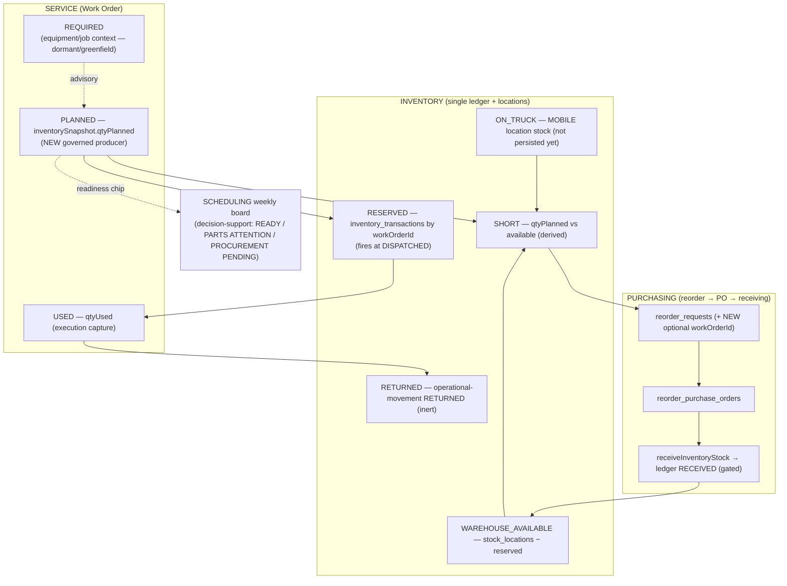

# WO Parts Planning — Repository & Data-Flow Assessment (design-first)

Status: **ASSESSMENT — not ratified.** Design-first per Owner direction. No implementation, and **no new governed write seam** is to be built until the material decisions in §I are made. Grounded in a code inventory of `main` @ `d124714` (five parallel authority traces).

Objective: let a Work Order eventually answer **"Does this Technician have what is needed to perform this job?"** — by separating REQUIRED / PLANNED / RESERVED / ON_TRUCK / WAREHOUSE_AVAILABLE / SHORT / PROCUREMENT_REQUIRED / USED / RETURNED, without collapsing them into one "parts" field and without forking any existing model.

Headline finding: **almost every one of the nine concepts already has a canonical authority.** WO Parts Planning is therefore mostly a **read-model/projection that composes existing authorities**, plus exactly **one missing governed write** (a producer for planned quantities) and **one additive linkage field** (a Work-Order back-reference on reorder requests). The failure mode to avoid is building any parallel inventory, reservation, Part, procurement, or equipment model.

---

## A. Current repository / data-flow assessment

**The Work Order already carries a parts array — but it has no governed producer.**
- `WorkOrder.inventorySnapshot?: InventorySnapshotItem[]` (`field-ops-app-vite/src/types/workOrder.ts:100`; server mirror `functions/src/types/workOrder.ts`). Item shape: `{ sku, name?, qtyPlanned?, qtyUsed?, category?, notes? }`. The type comments label it "optional, non-authoritative, purely descriptive… NOT read or written by createWorkOrder()/transitionWorkOrder()."
- `qtyPlanned` is **read everywhere** (ExecutionCapture, WorkOrderDetail, PartsOverviewPanel, analytics) but **written nowhere in production code** — the claimed "wizard writes inventorySnapshot" path does not exist in `src`. Today only seed/test data populates it.
- `updateWorkOrderExecutionData.ts` is the **only** WO-parts writer: technician-only, own-assignment, and it mutates `qtyUsed` on **already-present** snapshot items (rejects any SKU not already planned). It cannot create planned parts.
- `createWorkOrder` / `transitionWorkOrder` deliberately never touch parts.

**Reservation/consumption already exists and is already wired to the WO lifecycle.**
- Ledger `inventory_transactions` (append-only, ADR-003) with types `RESERVED | RELEASED | CONSUMED` (`functions/src/types/inventoryTransaction.ts`). Writers `reserveParts/releaseParts/consumeParts` (`functions/src/inventoryService.ts`).
- `STATE_TRIGGERS` (`inventoryService.ts:206`): **DISPATCHED → reserveParts, COMPLETED → consumeParts, CANCELLED → releaseParts**, run post-commit from `transitionWorkOrder.ts:133` via `triggerInventoryEffects()`. Demand source = the WO's own `inventorySnapshot[].qtyPlanned`.
- So a WO's **RESERVED/ALLOCATED** is already `inventory_transactions` entries scoped by `workOrderId+partId`; outstanding = `reserved − released − consumed`.

**Availability is derived on read, never stored; physical on-hand truth is explicitly deferred.**
- No mutable "current stock" doc exists. `getAvailableQuantity` = `warehouseQty − (reserved − released)`, but `warehouseQty` is a **static, non-authoritative baseline** from `data/partsCatalog.ts`, not physical on-hand.
- The authority contract (`docs/architecture/inventory-parts-authority-contract.md`, UD-3) is emphatic that the current taxonomy is **not** a complete physical on-hand ledger and the final ledger topology is **DEFERRED**.
- Bin-level `stock_locations {warehouseId, partId, quantity, binCode}` is a physical-reality layer read via `operationsQueries.ts`; warehouse on-hand is aggregable from it.

**Truck inventory has identity but no stock.**
- Trucks are **MOBILE locations** (Truck Registry: `trucks` + `mobile_locations`, ADR-010). But **no collection is MOBILE/truck-keyed for stock** (`operationalReferenceProbe.ts`), so **"what's on truck X" is not answerable today.** The read-model composers (`mobileLocationInventoryProjection.js`, `serializedAssetInventoryLocation.js`, `truckInventorySource.js`) exist as **inert seams** returning "unavailable."

**Procurement chain is built but WO-disconnected.**
- `reorder_requests` (sole writer `domain/inventoryReorderRequests.js`) → `reorder_purchase_orders` (`domain/reorderPurchaseOrders.js`, transitions to ORDERED) → receiving (`receiveInventoryStock`, stages a `RECEIVED` operational-movement into the ledger). **A reorder request links only to a `partId`, never to a Work Order** — a WO shortage cannot raise procurement today.
- Enterprise receiving is gated behind `RECEIVING_TRANSPORT_READY=false`; the loop closes at status level today, at the ledger level only after activation.

**REQUIRED (from equipment/job context) is not derivable today.**
- `equipment_part_compatibility` (`equipmentModelId → partId`, with `compatibilityType {DIRECT_FIT, APPROVED_ALTERNATE, OPTIONAL_ACCESSORY, CONSUMABLE}` + `quantityRequired`) is the authority for "which parts fit this equipment **model**" — but it is **built, unwired, and capability-inactive** (`active:false`), answering per model not per installed asset.
- A WO has **no equipment link** in code (`workOrder.equipmentId` is ADR-006-designed, unimplemented; the installed-asset Equipment collection isn't built).
- **Job-type → required-parts is entirely greenfield** (no service-procedure/task-template/BOM; PM-kits were explicitly rejected from the compatibility model).

---

## B. Duplicate-model risks (hard "do NOT" list)

1. **No parallel reservation store.** RESERVED/RELEASED/CONSUMED scoped by `workOrderId` already *is* WO allocation. Project from the ledger; never add a second reservation collection.
2. **No mutable balance cache.** No `currentStock` doc exists by design; availability is always derived on read.
3. **No second ledger.** Operational movements (RECEIVED/TRANSFER_*/RETURNED/…) append to the *same* `inventory_transactions` with a `schemaVersion:2` discriminator, through the existing injectable seam. Do not create a new ledger.
4. **Do not conflate on-hand / reserved / available**, and do not silently decide the **deferred** physical-on-hand topology.
5. **No parallel Part/SKU table.** `parts` (branded `partId`) is canonical; `partsCatalog.ts` is non-authoritative UI metadata. Plans key on **`partId`**, not the catalog SKU.
6. **No parallel truck-stock model.** Trucks are already MOBILE locations under the Truck Registry (1:1 claim invariant).
7. **No parallel procurement path.** Use the live `reorder_requests → reorder_purchase_orders → receiveInventoryStock` chain — **not** the dormant Epic-5 `purchase_orders` / `procurementDraftEngine` / `procurementBridge`.
8. **No parallel equipment/compatibility schema.** `equipmentCompatibility/domain/*` (mirrored to the client `.js`) is canonical and parity-tested; activate/wire it, never re-model it. Follow ADR-006 for the WO↔equipment link.
9. **No new recommendation framework.** Reuse the `ReplenishmentRecommendation` + proposal-bridge pattern and the "recommendations are governed objects; recommend-never-execute" doctrine.

---

## C. Canonical authorities (one owner per concept)

| Concept | Canonical authority | Status |
|---|---|---|
| Work Order lifecycle | `functions/src/transitionEngine.ts` / `transitionWorkOrder.ts` | live |
| WO parts array (`inventorySnapshot`) | the WO doc; **no governed producer of `qtyPlanned`** | schema live, producer MISSING |
| WO parts USED (`qtyUsed`) | `updateWorkOrderExecutionData.ts` (technician, own-assignment) | live |
| Reservation / consumption | `inventory_transactions` ledger via `inventoryService.reserve/release/consumeParts`, triggered by WO state | live |
| Warehouse on-hand | `stock_locations` (+ ledger for net-available); read `operationsQueries.ts` | live (interim baseline) |
| Physical on-hand ledger topology | authority contract UD-3 | **DEFERRED** |
| Part identity | `parts` collection, `functions/src/partMaster/*` (branded `partId`) | live |
| Procurement terms (cost/lead/preferred) | `part_supplier_items` (`partId__supplierId`) | write live/gated; read gated on R-1 |
| Reorder requests | `domain/inventoryReorderRequests.js` (`reorder_requests`) | live; **no WO link** |
| Purchase orders | `domain/reorderPurchaseOrders.js` (`reorder_purchase_orders`) | live |
| Receiving → stock | `functions/src/inventoryReceiving/*` (ledger `RECEIVED`) | built, gated `RECEIVING_TRANSPORT_READY=false` |
| Truck-as-location | Truck Registry (`trucks`/`mobile_locations`) | identity live; **on-truck stock: none** |
| Equipment → parts | `equipment_part_compatibility` (per model) | built, **unwired + inactive** |
| WO → equipment link | ADR-006 `workOrder.equipmentId` | designed, unimplemented |
| Job-type → required parts | — | **greenfield** |
| Advisory recommendations | `inventoryAnalyticsService` + proposal bridges; "recommend-never-execute" doctrine | live (analytics), advisory |

---

## D. Proposed WO Parts Planning information model

The nine states are **not one array** — they are distinct facts, most already sourced from a canonical authority. Proposed: a **derived projection** (`workOrderPartsPlan`) keyed on **`partId`**, one row per planned part, each field sourced as below. Only PLANNED needs a new writer; only PROCUREMENT_REQUIRED needs an additive link.

| State | Meaning | Source authority | Buildable now? |
|---|---|---|---|
| **REQUIRED** | what the job/equipment says is needed | equipment_part_compatibility (per model) + job-type requirements | **No** — compatibility dormant + no WO↔equipment link; job requirements greenfield. Future advisory input. |
| **PLANNED** | what Dispatch/Service intends to provide | `inventorySnapshot[].qtyPlanned` | Schema yes; **needs a governed producer (the one new write)** |
| **RESERVED / ALLOCATED** | inventory actually committed | `inventory_transactions` RESERVED by `workOrderId` (fires at DISPATCHED) | **Yes (derive)** |
| **WAREHOUSE_AVAILABLE** | pickable before dispatch | `stock_locations` on-hand − open RESERVED | **Yes (derive)**, on interim baseline; physical-on-hand deferred |
| **ON_TRUCK** | available to the assigned technician | MOBILE-location stock | **No** — no MOBILE-keyed stock persistence; honest "unavailable" |
| **SHORT** | required/planned but unavailable | `qtyPlanned` vs available (the `reserveParts` insufficient check) | **Yes (derive, transient)** — do not persist a new field |
| **PROCUREMENT_REQUIRED** | must enter purchasing | linked `reorder_requests` state | Needs **additive `workOrderId`** on reorder request |
| **USED** | actually consumed | `inventorySnapshot[].qtyUsed` (execution capture) | **Yes** |
| **RETURNED / UNUSED** | planned/picked but not consumed | operational-movement `RETURNED` type (inert) | **No** — future (MOBILE ledger) |

Design consequences:
- **PLANNED ≠ RESERVED by time.** Planning is pre-dispatch intent; reservation already fires at DISPATCHED. The model must keep them distinct (the Owner's exact ask) — planning does not itself reserve.
- **REQUIRED and ON_TRUCK and RETURNED are honestly "not yet available"** in v1 and must render as such, never fabricated.
- The plan is a **projection**, not a new stored aggregate; the only persisted new datum is the planned quantity (which lives in the existing `inventorySnapshot`).

---

## E. Lifecycle — planning through consumption

```
CREATE WO ──▶ PLAN PARTS ──▶ (availability check / SHORT?) ──▶ SCHEDULE ──▶ DISPATCH ──▶ FIELD EXECUTION ──▶ COMPLETE
              (set qtyPlanned)   │                                          │(RESERVED fires)   │(qtyUsed)      │(CONSUMED fires)
              NEW governed write  │                                          │                   │              │
                                  ▼                                          ▼                   ▼              ▼
                          SHORT ──▶ PROCUREMENT_REQUIRED              ON_TRUCK/pick        USED vs PLANNED   RETURNED (unused)
                                    (reorder_request + workOrderId)   (future MOBILE)                        (future)
                                    → PO → receiving → ledger RECEIVED
                                    → availability improves → re-plan/ready
```
- **Reserve at DISPATCHED, consume at COMPLETED, release at CANCELLED** are existing triggers — WO Parts Planning does not re-implement them.
- Whether planning may **stage/pick to a truck before dispatch** (an earlier reservation/movement) is a lifecycle-authority decision (§I), not assumed here.

---

## F. Persona / action authority (actions, not roles)

Per direction: identify **what actions require authority**; the separate Persona/Permissions architecture governs how they are granted. Do **not** infer authority from persona names.

| Action | New or existing authority | Notes |
|---|---|---|
| Author/edit a WO's planned parts (`qtyPlanned`) | **NEW capability** (e.g. `workOrder.parts.plan`) | The one new governed write. Personas likely involved: Service Manager, Dispatcher, Parts Room Manager — but authority is the capability, granted by the persona architecture. |
| Read a WO parts plan / readiness | **NEW read capability** | Cost/terms sub-fields remain gated on `inventory.catalog.read` / `.cost.read` (R-1). |
| Record parts USED (`qtyUsed`) | existing (`updateWorkOrderExecutionData`, technician own-assignment) | unchanged |
| Reserve / release / consume | existing, **system-triggered** by lifecycle | no direct human authority |
| Raise procurement from a WO shortage | existing `reorder.request.create` | reused with a WO back-link |
| Pick / stage to truck | **future movement authority** (MOBILE ledger) | not in v1 |

---

## G. Service ↔ Inventory ↔ Purchasing integration model



- **Scheduling integration (Owner §10):** the weekly board surfaces a per-job **readiness chip** (READY / PARTS ATTENTION / EQUIPMENT ATTENTION / PROCUREMENT PENDING) computed from the plan projection — **decision-support only, non-blocking**; Scheduling does not become an inventory workspace and does not prevent scheduling on a shortage unless a governed rule later requires it.
- **Technician integration (Owner §7):** F0/F1 Current Job consumes the **same** projection, labelled PLANNED FOR JOB / ON MY TRUCK / READY FOR PICKUP / MISSING / PROCUREMENT PENDING / USED / RETURNED. Phone/tablet/laptop share one authority — no separate mobile parts-plan model.
- **AI seam (Owner §9):** advisory only — "this job requires Part X; assigned truck has none / Warehouse Main has 2 / preferred supplier lead time 3 days." Emitted as a governed recommendation object; humans/services decide and execute. Not authoritative in any increment.

---

## H. Sandbox scenario design (unifies Scheduling + Parts Planning)

Design (not yet build/deploy) an interconnected **service-week** dataset so Scheduling and Parts Planning are one simulation:
- **People/locations:** 4–5 technicians; multiple customers and locations; a mix of equipment/job contexts.
- **Week shape (Mon–Sun):** multiple WOs per technician; varied durations; one **overloaded/overlapping** tech and one **underutilized** tech; **past-due/attention** work; a spread of statuses (READY_TO_DISPATCH, SCHEDULED, DISPATCHED, IN_PROGRESS, COMPLETED).
- **Parts thread (the connective tissue):** a Tuesday WO plans 3 parts (`inventorySnapshot.qtyPlanned`) → 1 **on truck** (renders "unavailable" honestly in v1) / 1 **warehouse-available** (`stock_locations`) / 1 **short** → raises a `reorder_request` (with `workOrderId`) → `reorder_purchase_order` (ORDERED) → receiving (RECEIVED movement) → availability improves → dispatch reserves → technician consumes → completion; one planned-but-unused part illustrates RETURNED (future).
- **Seed shape, existing collections only:** `fieldops_wos` (with `inventorySnapshot`), `reorder_requests`/`reorder_purchase_orders`, `stock_locations`, `inventory_transactions` (RESERVED), `trucks`/`mobile_locations`. No new collections.
- **Note:** building the seed is repo work; **deploying it to the live `eos-platform-sandbox` is a separate step** (protected — see §I). This assessment designs the scenario; it does not deploy it.
- **Rendered review** of Scheduling + these surfaces uses the **Verenward / Gate-3 product design direction** (currently on separate in-flight branches), at the Owner Experience Review stage.

---

## I. Protected / material decisions required (for Owner ratification)

1. **Where the PLANNED write seam lives** — the one new governed write. Options: (a) extend `createWorkOrder` to seed `inventorySnapshot`; (b) a new dispatch/planning callable mirroring `updateWorkOrderExecutionData` (admin/dispatcher-class); (c) a planning branch in `transitionWorkOrder`. **Do not build until chosen.**
2. **The new planning capability id + who may hold it** — resolved by the Persona/Permissions architecture, not invented here.
3. **Physical on-hand ledger topology (DEFERRED, UD-3)** — WAREHOUSE_AVAILABLE is on an interim static baseline until this is decided; WO Parts Planning must not silently decide it.
4. **Reserve/pick timing** — keep reservation at DISPATCHED only, or allow pre-dispatch staging/pick to a truck (a new movement authority)?
5. **Procurement back-link** — approve the additive optional `workOrderId`/`sourceWorkOrder` on `reorder_requests` (schema addition; the only procurement-side change).
6. **REQUIRED derivation scope** — is Equipment-Compatibility activation (deploy + capability grant) and the ADR-006 WO↔equipment link in-scope-later, or is REQUIRED deferred while PLANNED stays a human decision in v1? (Recommendation: defer REQUIRED; v1 PLANNED is human.)
7. **Receiving activation** (`RECEIVING_TRANSPORT_READY`) and **R-1 catalog-read** both gate parts of the loop; note the dependencies, don't flip them here.
8. **Sandbox seed deployment** to the live sandbox environment — a separate protected step.

---

## J. Recommended implementation sequence (design-first, then repo-only increments)

- **Phase 0 — Ratify §I decisions** (esp. #1 write-seam home, #6 REQUIRED scope). No code.
- **Phase 1 — Parts-Plan read-model (repo-only, NO new write).** A pure `workOrderPartsPlan` projection composing existing authorities into the nine states, rendering REQUIRED/ON_TRUCK/RETURNED as honest "not yet available." High value, fully reversible, no protected boundary. *This is the strongest first increment and needs no new write.*
- **Phase 2 — Governed PLANNED producer.** Build the one new governed write (per the ratified §I.1 home), behind a fail-closed readiness seam. Enables RESERVED to flow at dispatch from real planned data.
- **Phase 3 — Procurement back-link.** Additive `workOrderId` on `reorder_requests` + a "raise procurement from a WO shortage" path reusing `createReorderRequest`.
- **Phase 4 — Scheduling readiness chips.** Surface READY / PARTS ATTENTION / PROCUREMENT PENDING on the weekly board from the projection (decision-support, non-blocking).
- **Phase 5 — Technician Current-Job parts view.** F0/F1 consumes the same projection (PLANNED FOR JOB / ON MY TRUCK / …).
- **Future / protected:** ON_TRUCK real MOBILE-location persistence; REQUIRED via Equipment-Compatibility activation + ADR-006 WO↔equipment; physical on-hand ledger topology; receiving activation; AI next-best-action.

Each phase after 0 is a repo-only increment that stops at the next protected boundary; the read-model (Phase 1) deliberately comes first because it composes what already exists and exposes the seams honestly without any new authority.
