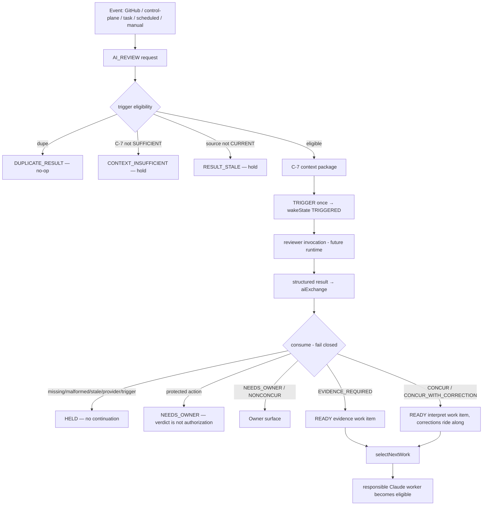

# Reciprocal AI-Review Trigger / Result Contract (provider-neutral, event-first)

**Repo-safe contracts + tests only.** No endpoint, no OpenAI key, no API spend, no webhook secret, no
Firebase deploy, no production service identity, no provider invoked. Implementation:
[`lib/reviewTrigger.mjs`](lib/reviewTrigger.mjs) · tests
[`lib/reviewTrigger.test.mjs`](lib/reviewTrigger.test.mjs).

**Thesis.** EOS owns timing and routing. An AI reviewer (OpenAI, Anthropic, or a manual Owner relay)
is a **worker EOS invokes when reasoning is required** — not the heartbeat. The primary path is
**event-driven**; periodic scheduling exists only as a **reconciliation backstop**. Hourly ChatGPT
Tasks must never be the EOS heartbeat.

## No second anything

The lifecycle **composes existing contracts** — it adds no second queue, ledger, context mechanism,
or selector:

| Concern | Reused authority |
|---|---|
| request · lifecycle · dedupe · dispositions | `collaborationContract.mjs` (`requestType: "AI_REVIEW"`) |
| result record · verdicts · governance projection | `aiExchange.mjs` (`EXCHANGE_VERDICTS`, `createAiExchange`) |
| trigger state · mechanism | `wakeState.mjs` (+ `wakeSupervisor` `TRIGGER_KINDS`) |
| source freshness · stale disposition | `reviewProvenance.mjs` (`SOURCE_FRESHNESS`, `isAuthoritativeSource`) |
| selected model | `modelPolicy.mjs` (`resolveDispatchModel`, delegated → SONNET-class) |
| consumed result → eligible worker | `resultConsumption.mjs` + `selectNextWork.mjs` |

## Trigger taxonomy — `REVIEW_TRIGGER_SOURCES`

`GITHUB_EVENT` · `CONTROL_PLANE_EVENT` · `TASK_TRIGGER` · `SCHEDULED` · `MANUAL`. The first three are
event/automatic; `SCHEDULED` is the recovery backstop only; `MANUAL` is the Owner-relay path. Each
source maps to the existing wake mechanism (`MANUAL → MANUAL_RUNTIME_TRIGGER`, else
`AUTOMATIC_TRIGGER`) — same contract regardless of source.

## Result taxonomy

- **Verdicts** (reused from `aiExchange`): `CONCUR` · `CONCUR_WITH_CORRECTION` · `NONCONCUR_ESCALATE` ·
  `EVIDENCE_REQUIRED` · `NEEDS_OWNER` · `AUTO_RESOLVED`.
- **Fail-closed kinds** `REVIEW_FAILURE_KINDS`: `RESULT_MISSING` · `RESULT_STALE` ·
  `RESULT_UNVERIFIABLE` · `PROVIDER_FAILED` · `TRIGGER_FAILED` · `CONTEXT_INSUFFICIENT` ·
  `MALFORMED_RESULT` · `DUPLICATE_RESULT`. **None is ever approval.** Silence ≠ approval; a review
  verdict ≠ execution authorization; a reviewer can never authorize a protected action.

**Result shape** (compact; field names reused where contracts already define them): `exchangeId`,
`requestId`, `reviewerRole`, `provider`, `selectedModel`, `triggerKind`, `verdict`, `conclusion`,
`corrections`, `evidenceRequired`, `ownerDecisionRequired`, `evidenceRefs`, `contextPackageRef`/
`provenance`, `sourceFreshness`, `requestedAt`, `triggeredAt`, `completedAt`, `consumedAt`,
`disposition`. Transcripts are **not** stored as normal context.

## Lifecycle

## Repository-vs-runtime authority boundary

**Runtime exchange ≠ durable institutional authority.** The whole lifecycle (request · trigger state ·
reviewer invocation · result · consumption state · provenance) is **runtime** state held in an
**injected store adapter** — nothing here writes git, and **no commit is required per exchange**. A
repository `aiExchange` artifact is *one valid backing today* (it proves the contract in this repo-safe
environment); a durable **runtime control-plane store** is a future seam — **not chosen or deployed
here**. Only **ACCEPTED (CONCUR/correction/auto-resolved), CURRENT-source, CONSUMED** results become
**promotion candidates** into repository authority, via `promoteToDurable()` — which computes the
candidate and **does not write**. Institutional knowledge stays repository-sourced; the runtime plane
carries the churn.

## Control Center projection implications

`projectReviewTriggerBoard()` yields counts by trigger source, verdict, and fail-closed kind, plus
`open`/`consumed`/`held`/`ownerSurfaced`. It aligns with the existing wake board's honest
"authorized-but-WAITING_FOR_TRIGGER" surface: a review can be *triggered but unconsumed* (awaiting
result), *held* (fail-closed), or *owner-surfaced* — none of which reads as done. The Control Center
gains a "Review supply" lane distinct from work supply, carrying `verdict ≠ authorization · silence ≠
approval` as a standing caption.

## Tests (injected/fake providers — no live call)

17 cases prove: event → eligible review → **invocation exactly once**; scheduled & manual → same
contract; duplicate event → **no duplicate review**; stale context / insufficient C-7 → hold; missing/
malformed/stale/provider/trigger failure → **no continuation**; `CONCUR` → consumable → responsible
worker eligible via the real selector; `CONCUR_WITH_CORRECTION` → **correction survives** consumption;
`EVIDENCE_REQUIRED` → evidence work/gate; `NEEDS_OWNER` → Owner surface; **protected action cannot be
authorized by a reviewer**; **Owner relay count stays 0** on the event path.

## Exact future activation seams (each protected — Owner-gated, not in this task)

1. **Trigger service / endpoint** — a hosted receiver for `GITHUB_EVENT`/`TASK_TRIGGER` that calls
   `buildReviewRequest` → `triggerReview`. Requires deploy + service identity. *Protected.*
2. **Provider adapter** — the code that actually invokes OpenAI (async/background Responses) and fills
   the structured result. Requires an API key + spend. *Protected.*
3. **Completion webhook** — OpenAI → EOS callback that lands the result into the store. Requires a
   webhook secret + endpoint. *Protected.*
4. **Runtime control-plane store** — the durable backing behind the injected adapter. Requires choosing
   + deploying a store. *Protected — deliberately not chosen here.*
5. **Durable promotion policy** — when governance promotes a `promoteToDurable` candidate into
   repository authority (the only git-writing step, governed). *Governed.*

Until those are activated, the contract runs entirely on injected fakes and repo `aiExchange`
artifacts — provably correct, with zero external dependency.
