# Administration: Policy and Access — EOS User Guide

**Audience:** Owner · Administrator · a delegated security administrator who holds the governed assignment authority
**Applies to:** `Administration ▸ Users` (the Employee record), `Administration ▸ Objects` (Object Security), `Administration ▸ Roles & Permissions`, `Administration ▸ Permission Preview`, `Administration ▸ Workflows`, `Administration ▸ Users ▸ Functional Roles`, `Administration ▸ Audit Logs`
**Training represents:** client `62e08988` (Vercel) · EOS API `62e08988` (Render)
**Effective date:** 2026-09-27
**Environment:** non-production — `https://verenwardeos.vercel.app`, tenant `taylor-nonprod`
**Owner:** Verenward product training

## What this guide helps you do

You administer **who may do what** in EOS for Taylor Freezer of Arizona. Everything in this guide is done in
EOS Administration. You never need source code, a database tool or a developer to make a normal access change,
and nothing here involves Firebase.

Every change you make is decided by the EOS server, recorded with **your name, the time and the reason you
give**, and takes effect on the next request. If the server refuses a change, EOS shows you the server's own
refusal, word for word (see [Refusals and anti-lockout](#refusals-and-anti-lockout)).

### I need to… → go here

| I need to… | Go here |
|---|---|
| give a person a Security Role, or take one away | `Administration ▸ Users` → open the person → **Security Roles** |
| set a person's Job Role, Work Eligibility or Operational Scope | `Administration ▸ Users` → open the person → **Job Role** / **Work Eligibility** / **Operational Scope** |
| change what a Security Role may do to a kind of record | `Administration ▸ Objects` → **By object** → choose the Object (**Object Security**) |
| see a Security Role's holders, actions and decision history | `Administration ▸ Roles & Permissions` → choose the Security Role |
| find out **why** a person can (or can't) do something | the person's **Effective Access** section, or `Administration ▸ Permission Preview` |
| give one person a single extra action as an exception | the person's **Direct Exceptions** section |
| see a person's workflow responsibilities | the person's **Workflow responsibilities** section |
| look at the Functional Role catalog | `Administration ▸ Users ▸ Functional Roles` |
| review workflow definitions and their validation | `Administration ▸ Workflows` |
| see who changed access, when and why | the person's **Access Audit History**, or a Security Role's **Decision history** |
| staff (or remove) the Administrator — **Owner only** | `Administration ▸ Users` → open the other person → **Security Roles** |

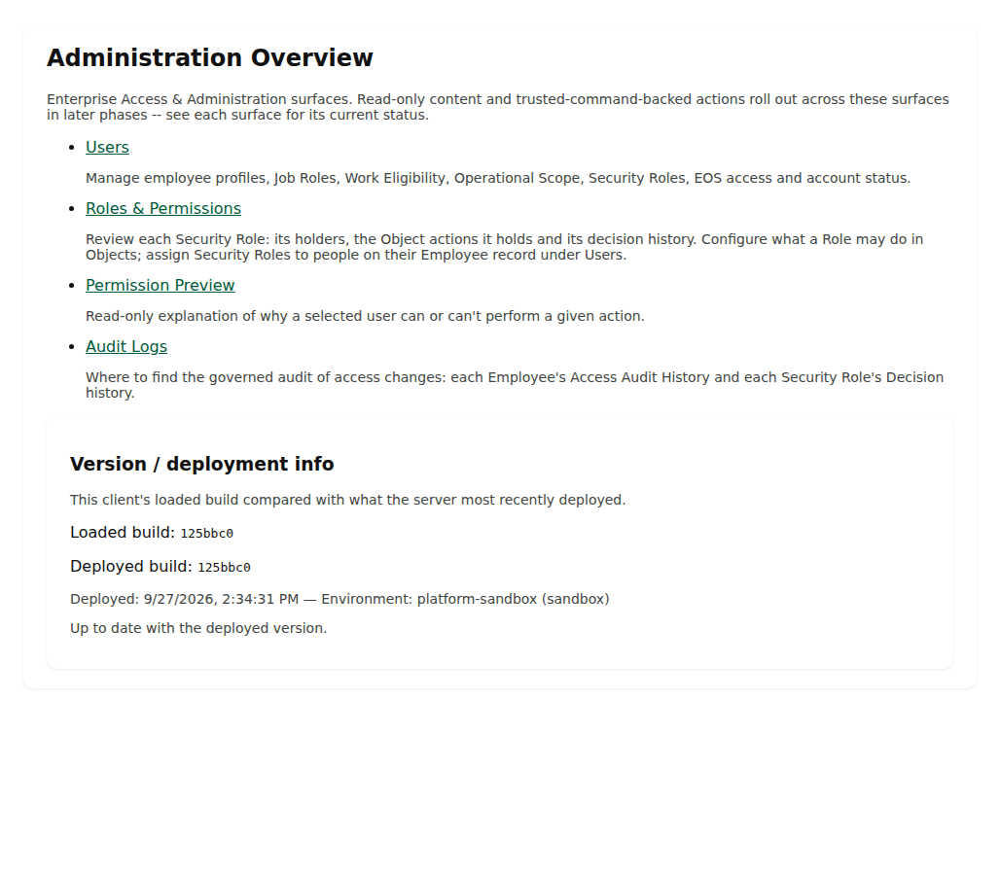

## Before you start

### The words this guide uses — they are different things

| Term | What it is | What it is **not** |
|---|---|---|
| **Employee** | The business / personnel record: name, Employee ID, employment status, job title, manager, operating company. | Not a login and not a permission. |
| **Principal** | The **security identity** EOS authorizes when someone signs in. An Employee is linked to one Principal (**User Access**). | Not the Employee record. |
| **Job Role** | The Employee's **business position** — for example *Retail Sales* or *National Accounts Sales* (two distinct Job Roles). | A Job Role grants **no** access and assigns **no** Security Role. |
| **Security Role** | **Authority**: a governed bundle of Object actions (capabilities). A person may hold several; their authority is what those Roles carry together. | Not a Job Role, and never inferred from one. |
| **Functional Role** | **Responsibility**: an operational/workflow responsibility a person holds. A workflow may *require* one. | Grants **nothing** — no capability, no access. |
| **Work Eligibility** | Whether the Employee is qualified for a kind of work (e.g. `SERVICE_TECHNICIAN`). | Not access. |
| **Operational Scope** | Where the Employee operationally works (a Warehouse or a Reorder Queue). | Not access by itself. |
| **Direct Exception** | One extra Object action given to **one Principal**, outside every Security Role, as a governed exception. | Not a substitute for sound Security Role design. |
| **Owner · Accountable · Assignee · Approver** | Distinct business relationships to a record or decision, used by the areas that manage those records. | None of them is a Security Role, and holding one does not imply another. |

A Security Role answers **"may this person perform this action at all?"** It is not the whole answer. A
**condition** on a grant (for example "only Work Orders assigned to this Employee"), a **scope** on an assignment
(for example "Company: Taylor"), Work Eligibility and Operational Scope can each narrow *where* otherwise-valid
authority applies. **Effective Access** shows the combined answer.

### Who may do what in Administration

| To do this | You need (held through a Security Role) | Who holds it today |
|---|---|---|
| read Object Security, Security Roles, Permission Preview | `admin.securityPolicy.read` | Administrator, Owner |
| change what a Security Role may do (grant, revoke, condition) and create/edit Roles; grant Direct Exceptions | `admin.securityPolicy.write` | **Administrator only** |
| give or remove a person's Security Roles | `admin.roleAssignment.write` | Administrator, Owner |
| staff or remove the **Administrator** for another person | `admin.administratorRole.assign` | **Owner only** |
| set Job Role / Work Eligibility / Operational Scope | `admin.employeeJobRole.write` · `admin.employeeWorkEligibility.write` · `admin.employeeOperationalScope.write` | Administrator, Owner |
| change a person's Functional Roles or the Functional Role catalog | `admin.employeeFunctionalRole.write` | **nobody yet** (see limitations) |
| edit or publish workflow definitions | `workflowDefinition.edit` · `.publish` · … | **nobody yet** (see limitations) |

**A General Manager does not administer roles.** Neither the General Manager Job Role nor the General Manager
Security Role carries `admin.roleAssignment.write`. Role administration is only ever a capability granted
through Administration, never something a title or Job Role implies.

### You must be set up in EOS first

A person appears under `Administration ▸ Users` when their Employee record exists, and can sign in when their
**User Access** is linked. Creating a person is an onboarding procedure, not a button on these screens.

## Normal workflow

### 1. Give a person a Security Role (the Employee record)

The **Employee record is the one place** where a person's Security Roles are given or removed.

1. Open `Administration ▸ Users` and select **View** (or the person's name).
2. Scroll to **Security Roles**. It lists the Roles the person holds, with **Scope**, **Scope value** and
   **Effective from**.
3. Under **Assign a Security Role**, choose the Role.
4. If the Role can be limited to a scope, a **Scope** picker appears. Choose **All (global)** or a governed value
   (for example **Company**). Values come only from EOS's governed list — there is no free-text scope. A scope type
   the Role cannot use is shown as *not available for this Role*, with the server's reason.
5. Type the **Reason (required, recorded in the audit trail)**. **Assign Security Role** stays disabled until you do.
6. Select **Assign Security Role**. The table re-reads from the server.

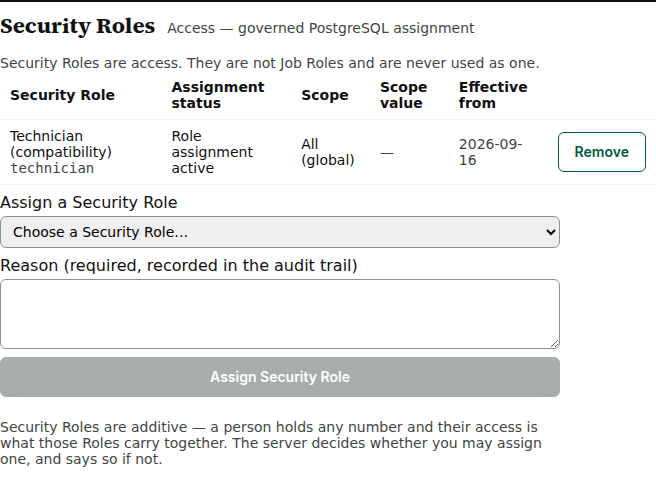

**Why a reason is required.** The reason is the business record of *why authority changed* — for later
review, for accountability, and for anyone investigating an access question months from now. Write what a
colleague would need to understand the change ("Covering parts desk during Kai's leave"), not a ticket number
alone. A request/correlation ID is provenance that EOS records automatically; it is **not** a reason, and the
server refuses a role change that has only one.

### 2. Remove a person's Security Role

1. Open the person → **Security Roles**.
2. Select **Remove** on the exact assignment, give the reason, and select **Confirm removal**.

Removal names one exact assignment; if the person holds the same Role at two scopes, only the one you chose ends.

### 3. Set Job Role, Work Eligibility and Operational Scope

On the same Employee record:

- **Job Role** — *Business function — does not change access.* Select **Assign Job Role**, choose from the
  company's active Job Role catalog, optionally add a reason (**Reason (optional)** — kept in the Job Role
  history), and **Save Job Role**.
- **Work Eligibility** — *Qualification for a kind of work — not access.* Choose a **Qualification** (for
  example `PARTS_OPERATIONS`), give the reason, and **Assign**; **End** ends a current one.
- **Operational Scope** — *Where the Employee operationally works — not access.* Choose a **Scope type**
  (**Warehouse** or **Reorder Queue**) and a governed target, give the reason, and **Assign**.

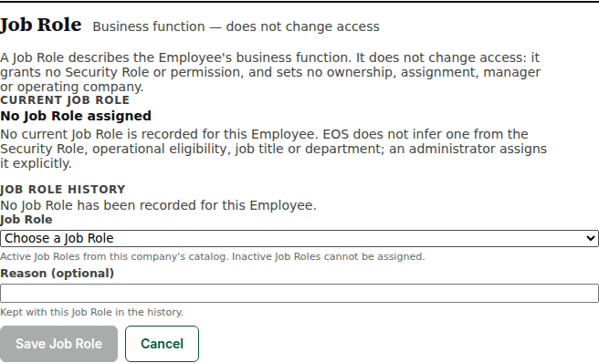
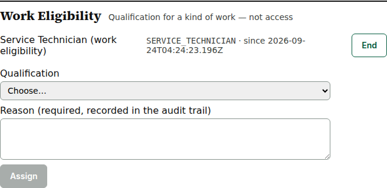

### 4. Change what a Security Role may do (Object Security)

Object Security is where governed Object authority is configured.

1. Open `Administration ▸ Objects` → **By object** → choose an **Object** (for example **Work Orders (7 actions)**).
2. Each **governed action** is listed with its label, kind and capability key — for example **Create Work
   Order · CREATE · `workOrder.create`**, **View Work Orders · READ · `workOrder.record.read`**, **Cancel Work
   Order · BUSINESS_ACTION**. Objects expose business actions, not a generic Create/Read/Edit/Delete grid.
3. Each row is a Security Role holding that action, with its **State** (for example **System default · Held**)
   and its **Administer** controls: **Revoke**, **Set condition**.
4. To give the action to another Role, select **Grant to another Security Role**, choose the **Security Role**,
   optionally a condition, type the **Reason**, and select **Confirm grant**.

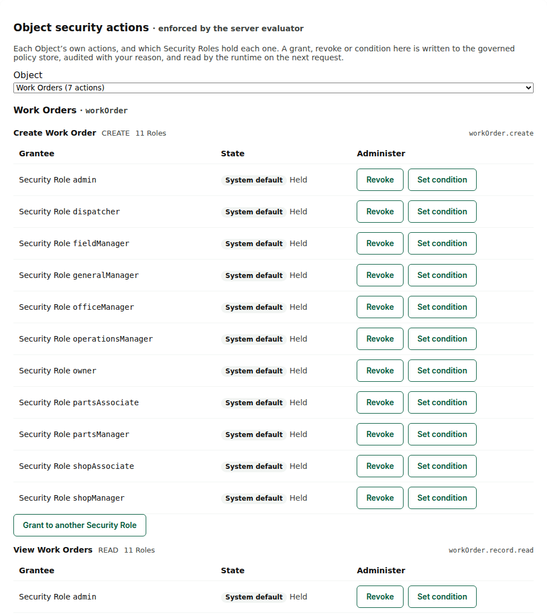
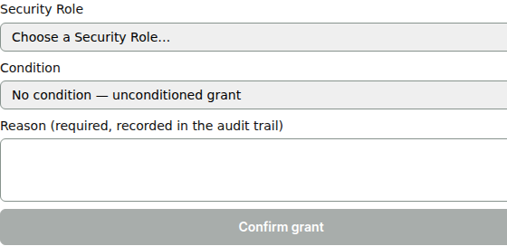

**Conditions** narrow a grant to some records. The **Condition** picker starts at **No condition —
unconditioned grant** and lists each condition by its code. Only conditions the server can enforce are
selectable, and today they apply to **View Work Orders** (`workOrder.record.read`):

| Condition (as shown) | Meaning |
|---|---|
| `RECORD_ASSIGNMENT` (relation `ASSIGNED_EMPLOYEE`) | only Work Orders assigned to the Employee |
| `WORK_ELIGIBILITY` | only while the Employee holds the chosen qualification |
| `OPERATIONAL_SCOPE` | only within the Employee's chosen Warehouse / Reorder Queue scope |

`SELF`, `TEAM`, `BUSINESS_UNIT` and `COMPANY` appear **disabled**, each followed by the server's reason (for
example *no evaluator: there is no team / reportsTo edge to evaluate*); a condition that does not apply to the
chosen action is disabled as *not applicable to this capability*. An Administration capability can never be
conditioned. **Company** is instead an
*assignment scope* (step 1, "Scope"), used today for Employee record reads.

**Retire condition** removes a condition. EOS refuses it while the grant is still held, because retiring it
would widen the grant to every record — revoke the grant first.

### 5. Review a Security Role (Roles & Permissions)

1. Open `Administration ▸ Roles & Permissions` and choose a Security Role (protected Roles are marked
   **· protected**).
2. The detail shows **Holders**, **Objects & actions** (expand an Object to administer its actions for this
   Role), and **Decision history** — every grant and revoke recorded for the Role, with reason, actor and whether
   it is current.

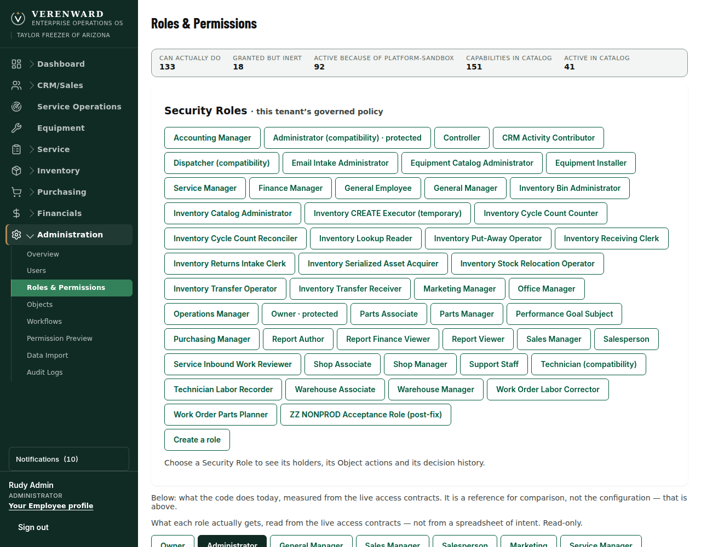
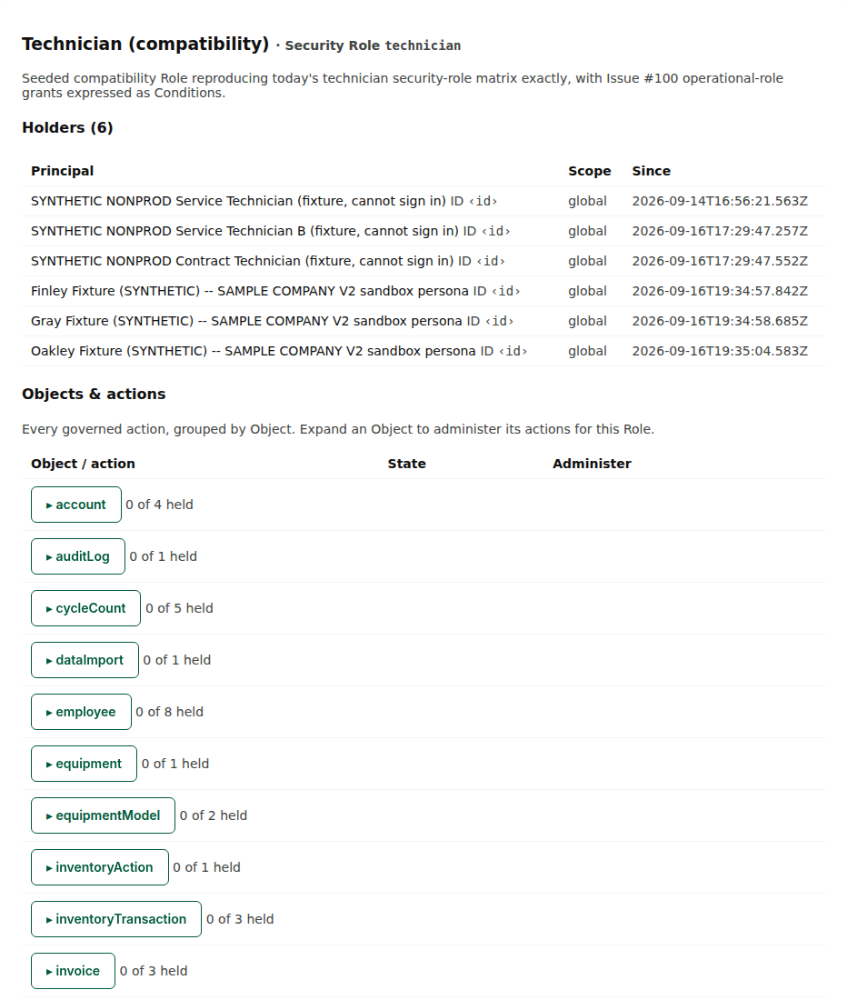
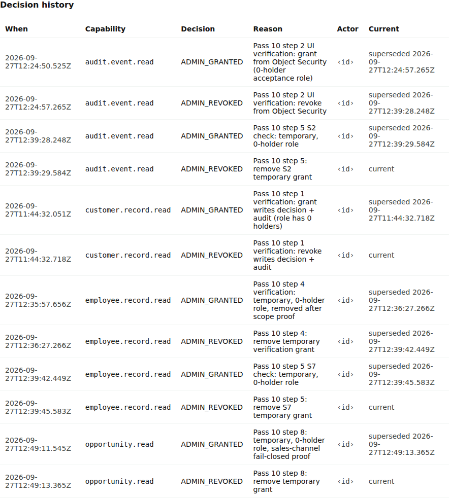

The lower half of the page ("*Below: what the code does today…*") is a **read-only reference** drawn from the
platform's built-in access contracts. It is not where permissions are configured and does not show changes made
in Object Security. A holder without a display name is shown as **Unnamed Principal**.

### 6. Answer "why can this person do this?" (Effective Access)

Open the person → **Effective Access** — *the server evaluator's explanation*. It is the authoritative answer
and uses the same evaluator EOS uses at run time.

- The summary shows **Security Roles that grant**, **Work Eligibility**, **Operational Scope**, **Capabilities**
  and **Surfaces**.
- **Employee facts — not a permission source** lists facts such as Functional Roles that grant nothing.
- **Excluded assignment** lists assignments that do not count, with the reason (for example
  **INACTIVE — Inactive assignment**: a Role the person held historically but no longer does).
- The table lists every Object action with its **Result** (for example **Allowed — ALLOWED** or **Denied —
  CAPABILITY_MISSING**), its **Source** (the Security Role and scope, or **DIRECT EXCEPTION**), and any
  condition. Use **Filter** to find an action.

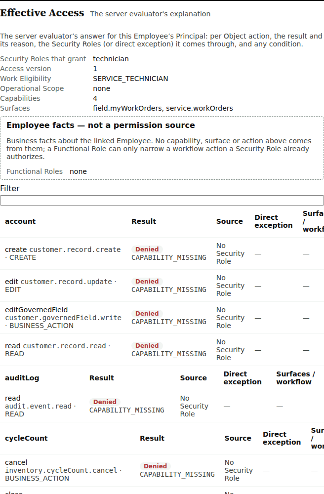

`Administration ▸ Permission Preview` gives the same security-grant view for any Principal, including one with no
Employee record. It shows Security Roles and Object actions only; Work Eligibility, Operational Scope and
record-level checks are evaluated separately.

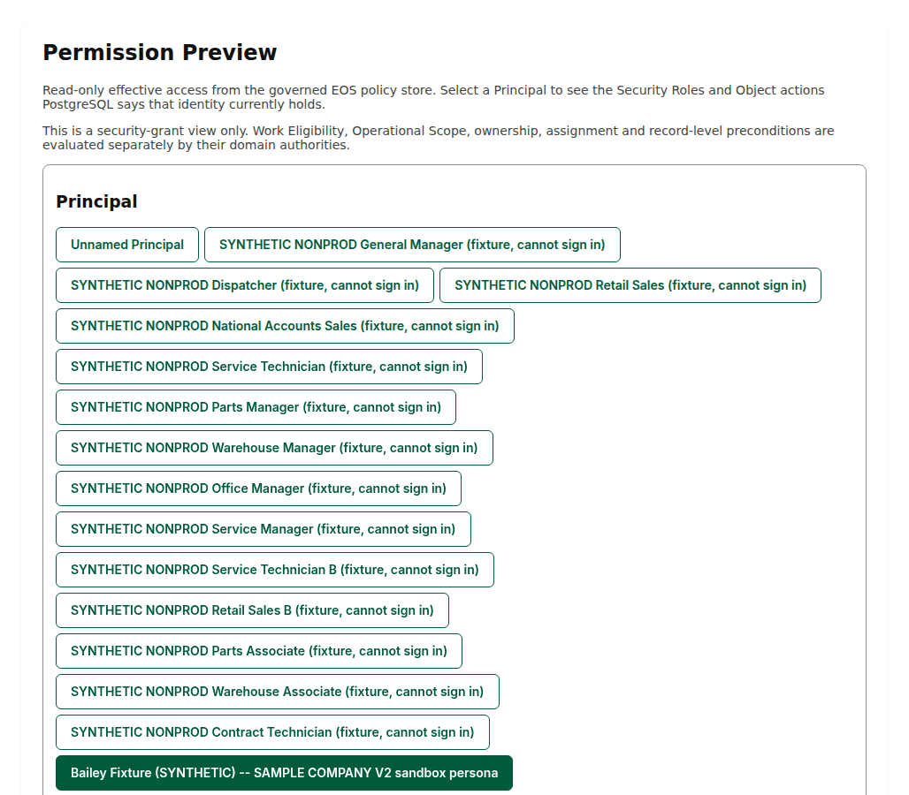

### 7. Direct Exceptions

A Direct Exception grants **one Object action to one Principal**, outside every Security Role. Use it for a
genuine, documented exception — never as the normal way to build someone's authority; if several people need
the same thing, change a Security Role instead.

1. Open the person → **Direct Exceptions** → **Grant a direct exception**.
2. Choose the **Object** and **Action**.
3. **Expires (optional; must be in the future)** — leave it empty for no expiry, or set a future date and time.
4. Type the **Reason (required, recorded in the audit trail)** and select **Grant direct exception**.

A Direct Exception carries **no scope** and may carry only a supported condition. It is enforced everywhere a
Role grant is, and shows in Effective Access as **DIRECT EXCEPTION**. **Revoke** ends it (with a reason).

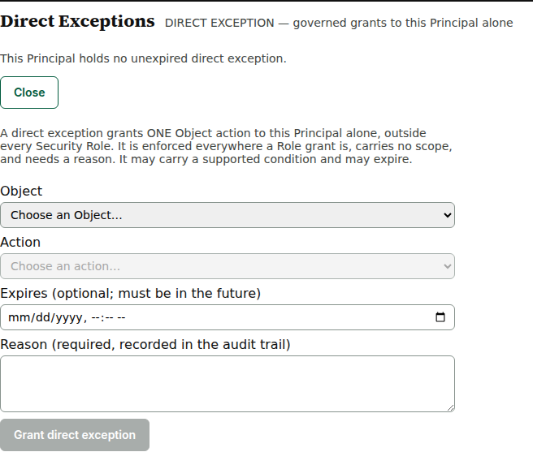

### 8. Functional Roles

A Functional Role is a **responsibility**, never authority. The catalog is at `Administration ▸ Users ▸
Functional Roles`; a person's Functional Roles are on their record under **Functional Roles**. A workflow action
may *require* a Functional Role **in addition to** a Security Role that holds the action's capability — it can
only narrow who may act, never grant.

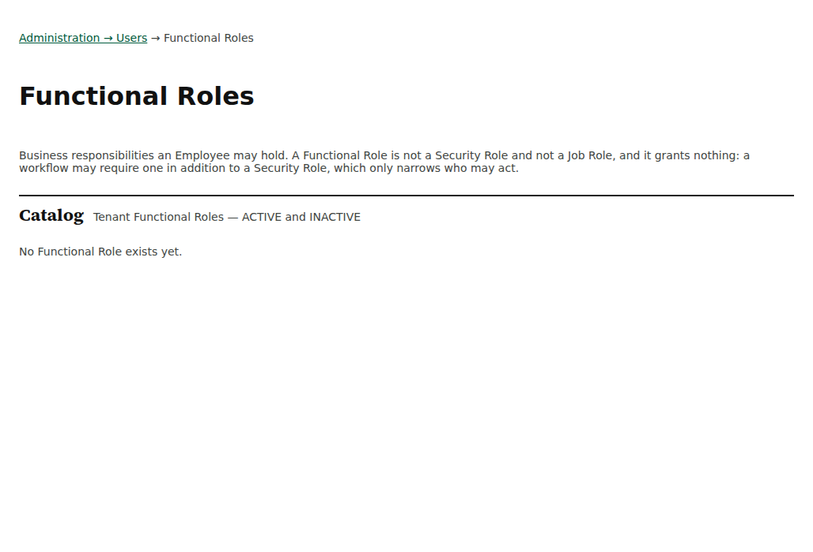
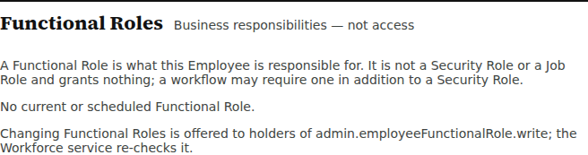

### 9. Workflows

`Administration ▸ Workflows` lists the workflow definitions by business area (Parts / Purchasing, Technician /
Work Order, Sales). A workflow governs **business actions** — not data access.

- Each workflow has **versions**: **Draft → Published (ACTIVE) → Retired**. A published version never changes;
  records already running stay on the version they started on. Editing a draft saves the next draft version.
- A version shows its **States**, and its **Actions, capabilities and bindings**: each action names the
  capability it *is*; a bound Security Role performs it only while it also holds that capability (and passes the
  guard). **A binding never grants.**
- **Validation** explains why a version cannot be published — for example **Error ACTION_WITHOUT_CAPABILITY**
  (*action "close" names no capability, so nothing could authorize it*).
- The lifecycle controls are **Publish (becomes ACTIVE)**, **Retire** and **New draft from this version**, each
  with a required reason.

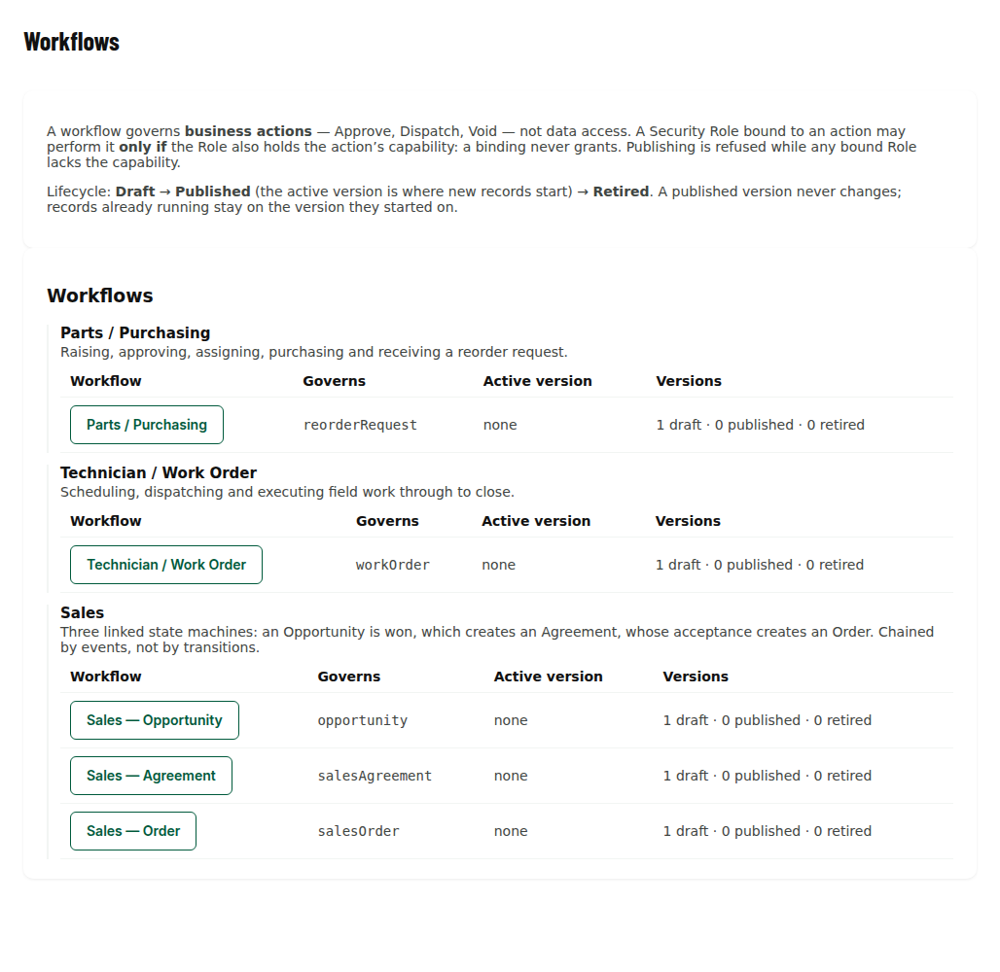
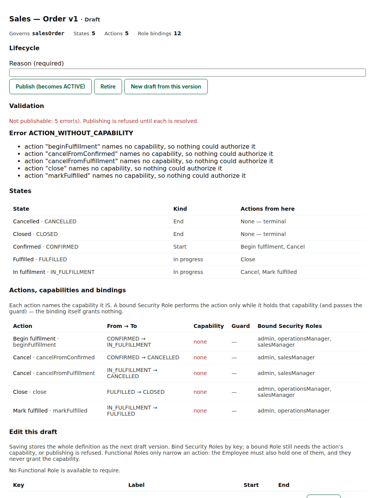

**Current state — read this.** Three different things are easy to confuse:

1. **The capability exists** — `workflowDefinition.edit`, `.publish`, `.version`, `.create`, `.bindRole` are
   defined.
2. **Nobody currently holds it** — no Security Role holds any of them; only `workflowDefinition.read`
   (Administrator, Owner) is held. The Workflow Administrator is **unstaffed**, so the lifecycle controls are
   refused by the server today.
3. **No workflow is active** — all five workflows have one **Draft** version and **no active version**.

Staffing a Workflow Administrator is a governed decision — escalate it; do not work around it.

### 10. Workflow responsibilities

On the person's record, **Workflow responsibilities** lists the actions in **ACTIVE** workflow versions this
Employee may perform — bound through a Security Role they hold, narrowed by any required Functional Role, and
allowed by the server evaluator. It is derived, never granted per person: to change it, change the Security Role,
Functional Role, workflow binding or Role grant named in **Change it in**. A responsibility is not authority by
itself. With no active workflow today it reads *No active workflow action is currently this Employee's
responsibility.*

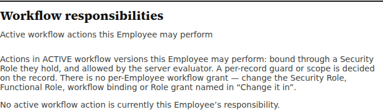

### 11. Staff the Administrator (Owner only)

The **Owner** can give the protected **Administrator (compatibility)** Security Role to **another** person, and
remove it from another person, using `admin.administratorRole.assign`.

1. Signed in as the Owner, open the **other** person's record → **Security Roles**.
2. Choose **Administrator (compatibility)**. Scope stays **All (global)** — scoped choices are shown *not
   available for this Role*.
3. Type the reason and **Assign Security Role**. To remove it, use **Remove** on that assignment with a reason.

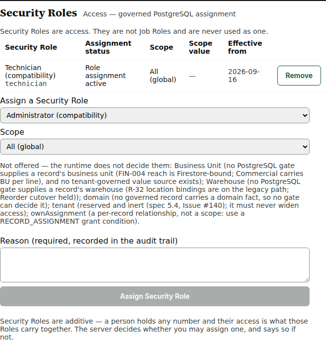

What this does **not** do:

- The Owner cannot give the Administrator Role to **themselves**.
- It gives the Owner **no** `admin.securityPolicy.write` — the Owner still cannot change what Roles may do.
- It works **only** for the designated Administrator Role, only **globally** — never another Role carrying
  security-policy authority, never a scoped Administrator.
- The **Administrator does not hold** `admin.administratorRole.assign`.
- Anti-lockout still applies (see below).

### 12. The protected Owner

The **Owner** Security Role is protected. **Ordinary Administration cannot appoint, remove, replace or transfer
an Owner** — not the Administrator, not the Owner, not anyone holding role-assignment or security-policy authority.
The Owner Role may appear in Role lists and a **Remove** button may appear on an Owner's own assignment; the server
refuses those changes. A tenant's first Owner is established by governed system provisioning, never from these
screens. **Owner succession or transfer is not available in this release** — escalate it.

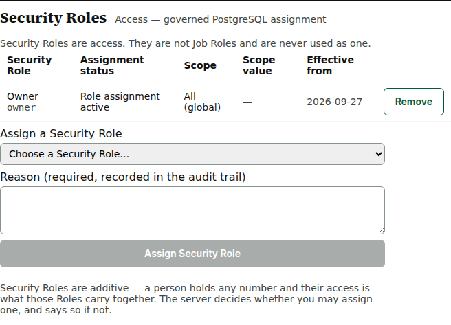

## What EOS does automatically

- **Audits every change** with the actor, time, before/after and your reason; request IDs are added as provenance.
- **Re-reads after every change** — a screen never shows a value the server refused.
- **Decides authority at run time** with the same evaluator Effective Access shows.
- **Protects against lockout**: it will not let a change leave the tenant with nobody able to administer security,
  assign roles, or recover Administrator staffing, and never leaves it without an Owner.
- **Keeps history**: an ended assignment stays visible (for example as **Excluded assignment · INACTIVE**).

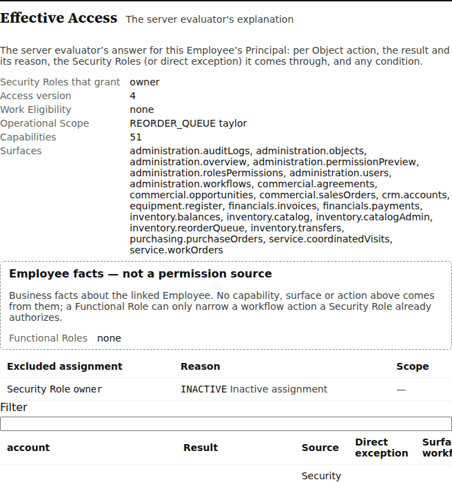

## Warnings and exceptions

### Refusals and anti-lockout

EOS shows a refusal as **`<category>: <server message>`**, verbatim. The ones an administrator is most likely to
meet:

| You will see | What it means | What to do |
|---|---|---|
| `FORBIDDEN: not authorized: "admin.securityPolicy.write" is required` (or `"admin.roleAssignment.write"`) | You do not hold the authority for this change. | Ask someone who does; escalate if nobody should. |
| `INVALID_INPUT: REASON_REQUIRED: assigning a Security Role requires a reason` (or `removing a Security Role…`) | No business reason was stated. The screen normally prevents this; other clients get this refusal. | Give a real reason. |
| `FORBIDDEN: SELF_ADMINISTRATION: a principal may not assign a Role to itself` | Nobody changes their own authority. | Another administrator must do it. |
| `FORBIDDEN: PROTECTED_OWNER_MEMBERSHIP: the protected Owner is not appointed through ordinary role administration (admin.roleAssignment.write, admin.securityPolicy.write and admin.administratorRole.assign are all insufficient); Owner succession is a separate governed lifecycle operation` (or `…not removed through…`) | Owner membership is protected. | **Escalate** — Owner succession is not an Administration task. |
| `CONFLICT: LAST_PROTECTED_OWNER: this is the tenant's last active protected Owner assignment; no ordinary role-assignment command may leave a tenant without an Owner` | Removing this would leave no Owner. | Nothing to do; this is intended. |
| `FORBIDDEN: PRIVILEGE_ESCALATION: assigning admin concerns admin.securityPolicy.write, which the acting principal does not hold (admin.administratorRole.assign admits only the designated Administrator Role, globally, for another principal)` | The Owner tried to staff a Role other than the Administrator, or a scoped Administrator. | Staff the Administrator Role, globally, for another person. |
| `CONFLICT: WOULD_REMOVE_LAST_ADMINISTRATION_PATH: no principal the gate would admit would still hold admin.administratorRole.assign; the tenant would become unadministrable` (or `…admin.securityPolicy.write`, `…admin.roleAssignment.write`) | The change would remove the last holder of an administration or Administrator-recovery authority. | Add another holder first, or leave it; escalate if unsure. |
| `INVALID_INPUT: this is the last active administering assignment -- revoking it would leave the tenant unadministrable` | Removing the last protected administering assignment. | Staff another Administrator first. |
| `INVALID_INPUT: SCOPE_VALUE_INVALID: '<value>' is not a governed Company of this tenant (…)` | A scope value outside EOS's governed list. | Pick a value from the picker. |
| `INVALID_INPUT: SCOPE_AMBIGUOUS_ADMINISTRATION: …` | A Role carrying Administration authority cannot be assigned or granted at a scope. | Assign it globally, or use a different Role. |
| `CONFLICT: CONDITION_RETIREMENT_WOULD_WIDEN: …retiring its condition would widen it to every record -- revoke the grant first` | Retiring a condition while the grant is held would widen it. | Revoke the grant first. |
| `CONFLICT: SYSTEM_INVARIANT: owner may never hold …` | A system rule forbids that pairing. | Nothing to change; this is intended. |
| `INVALID_INPUT: expiresAt must be in the future` | A Direct Exception expiry in the past. | Leave expiry empty or choose a future time. |

### Other things to know

- A Role **offered in a list is not a promise** it can be assigned — the server decides and says so.
- **Security Role and Job Role are separate on purpose.** Changing a Job Role never changes access, and
  assigning a Security Role never sets a Job Role.

## If something looks wrong

1. Open the person's **Effective Access** and read the action's **Result** and **Source** — it is the
   authoritative answer.
2. Check their **Security Roles** (and scope), **Work Eligibility**, **Operational Scope** and any **Direct
   Exceptions**.
3. Check the grant in **Object Security**, and the Role's **Decision history**.
4. Read the person's **Access Audit History** for who changed what, when and why.

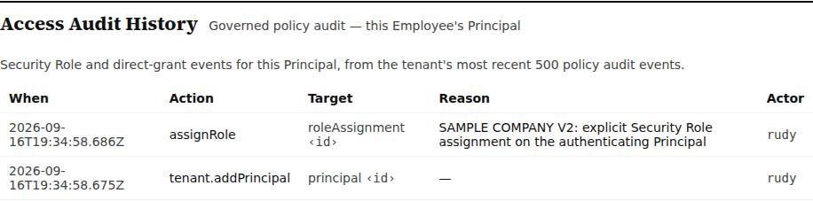

`Administration ▸ Audit Logs` does not yet show a consolidated tenant-wide list; it points to these two views.

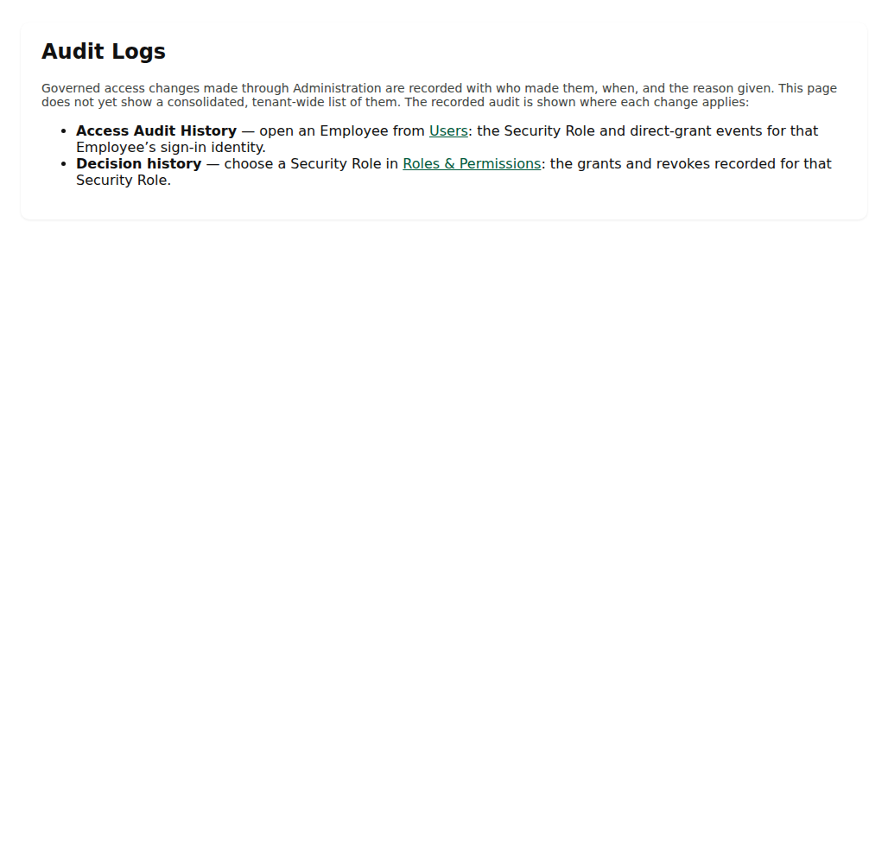

### Support and escalation

1. Your **Taylor EOS Administrator** first — most questions are configuration.
2. Owner succession, staffing a Workflow Administrator, and anything the administrator cannot resolve go to
   **Verenward** through the agreed support path.

*(The formal support procedure — severity, response commitments, the bug-versus-request boundary — is being
established under Customer 1 gate `C1-SUPPORT-01`. Until it is agreed, use the route your administrator gives you.)*

## Administrator notes

**Self-service in Administration:** assigning and removing Security Roles (Employee record); Job Role, Work
Eligibility and Operational Scope; Object Security grants, revokes and conditions; creating and editing Security
Roles; Direct Exceptions; the Owner's Administrator staffing.

**Not self-service — governed decisions to escalate:** Owner succession or transfer; establishing a tenant's first
Owner; staffing a Workflow Administrator and publishing workflows; granting Functional Role administration.

The Users directory (`Administration ▸ Users`) lists Employees; there is no separate role-assignment panel on it.

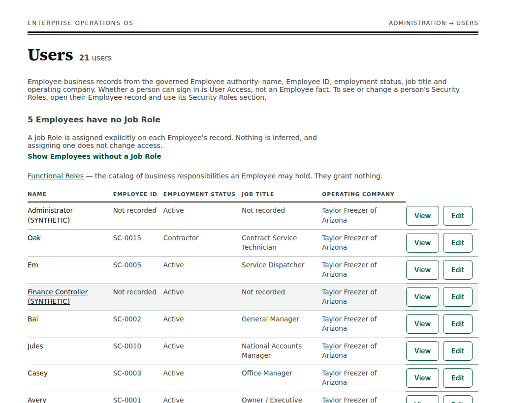

## Changes in this release

- **Object Security** is where Security Role authority is configured, per governed business action, with
  conditions — replacing the retired Create/Read/Edit/Delete permission grid.
- **The Employee record** is the one place to give or remove a person's Security Roles, with governed scope
  pickers and a **required business reason**. The earlier role panel on the Users page no longer exists.
- **Effective Access**, **Direct Exceptions**, **Functional Roles**, **Workflow responsibilities** and **Access
  Audit History** are on the Employee record.
- **Workflow Administration** shows versioned definitions with validation (read-only in practice until a Workflow
  Administrator is staffed).
- **The Owner can staff the Administrator** for another person; the Owner Role itself is protected.
- A person without a display name is shown as **Unnamed Principal**.
- **Known limitations:**
  - the Workflow Administrator is unstaffed — nobody holds `workflowDefinition.edit/publish/…`, and no workflow
    is active;
  - nobody holds `admin.employeeFunctionalRole.write`, so Functional Roles can be viewed but not changed yet;
  - Owner succession / transfer is not implemented; Owner membership cannot be changed through Administration;
  - `Audit Logs` has no consolidated tenant-wide list yet (use Access Audit History and Decision history);
  - supported conditions apply only to **View Work Orders**; `SELF`, `TEAM`, `BUSINESS_UNIT` and `COMPANY` are
    not supported conditions; the **Sales Channel** scope has no values configured yet;
  - on a narrow (phone) screen the Security Role **Holders** table scrolls sideways within its box.

## Verification receipt

- Training checked against deployed release/SHA: client `62e08988` (Vercel) and EOS API `62e08988`
  (Render `dep-dasr0uvf3r2c73b811hg`).
- Workflow exercised/visually verified: every screen, label, button and required/optional field in this guide
  was read from the deployed nonprod site as the Administrator and the Owner on 2026-09-27, read-only (no
  configuration changed to produce this guide). Capability holders, the condition/scope vocabulary and refusal
  wording were checked against the deployed server. The Security Role assignment, reason, protected-Owner and
  Administrator-staffing behavior was verified live during Pass 10 acceptance (PRs #1993–#1997).
- Screenshots current where used: yes — captured from the deployed nonprod site; internal identifiers redacted
  and no credentials shown.
- Known sandbox-only or future behavior present in guide: `NO` — Owner succession, a staffed Workflow
  Administrator, active workflows and a consolidated audit list are named only as not available.
- Training status: `COMPLETE`

## Deployment close record

The training-impact record required by `docs/training/README.md`.

```text
DEPLOYMENT:            Pass 10 — EOS Administration control plane (non-production, verenwardeos.vercel.app,
                       tenant taylor-nonprod); PRs #1983–#1997
AFFECTED ROLES:        Owner; Administrator; delegated security administrator (holders of
                       admin.roleAssignment.write); General Manager (no role administration by default)
AFFECTED WORKFLOWS:    Security Role assignment/removal (Employee record); Object Security grants, revokes
                       and conditions; Security Role review; Effective Access; Direct Exceptions; Job Role,
                       Work Eligibility and Operational Scope; Functional Roles (view); Workflow
                       administration (view/validation); workflow responsibilities; Owner staffing of the
                       Administrator; audit review
TRAINING GUIDES:       docs/training/administration-policy-and-access.md;
                       docs/user-guide/administration/manage-employees.md (security/access sections);
                       superseded: docs/user-guide/administration/see-what-a-role-can-do.md,
                       docs/user-guide/administration/see-who-can-do-what.md
TRAINING REPRESENTS:   client 62e08988 · EOS API 62e08988 (Render dep-dasr0uvf3r2c73b811hg)
EFFECTIVE DATE:        2026-09-27
MATERIAL CHANGES:      Object Security replaces the retired C/R/E/D grid; the Employee record is the only
                       Security Role assignment surface and requires a stated business reason; protected
                       Owner; Owner staffs the Administrator (admin.administratorRole.assign)
NEW USER ACTIONS:      grant/revoke/condition Object actions; assign/remove Security Roles with scope and
                       reason; Direct Exceptions (expiry optional); Owner staffs/removes the Administrator
ACCESS BEHAVIOR:       enforced by the governed EOS server evaluator; Effective Access shows the same answer;
                       anti-lockout and protected-Owner refusals are server-enforced
LIMITATIONS:           Workflow Administrator unstaffed, no active workflow; Functional Role changes not yet
                       available; Owner succession not implemented; no consolidated Audit Logs list; conditions
                       only on View Work Orders; Sales Channel scope has no values; Holders table scrolls on
                       phones
SUPPORT:               Taylor EOS Administrator → Verenward (formal procedure pending C1-SUPPORT-01)
TRAINING:              COMPLETE
VERIFIED:              2026-09-27 — deployed nonprod read-only walkthrough as Administrator and Owner at
                       62e08988; screenshots in docs/training/images/administration/
DEPLOYMENT STATE:      TECHNICALLY ACCEPTED — becomes CLOSED when the Owner merges this guide
```
